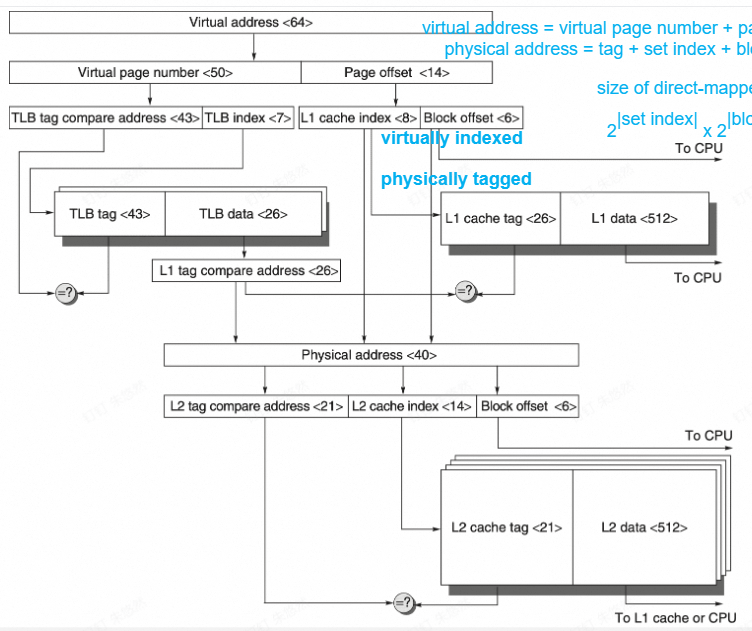
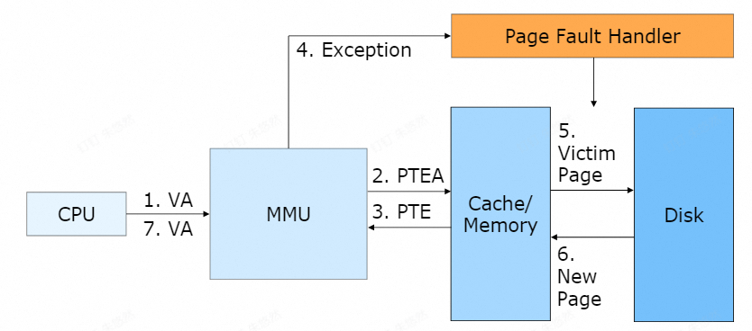
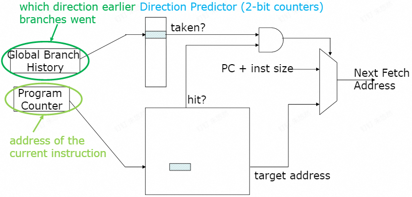
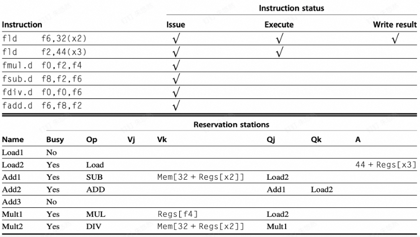
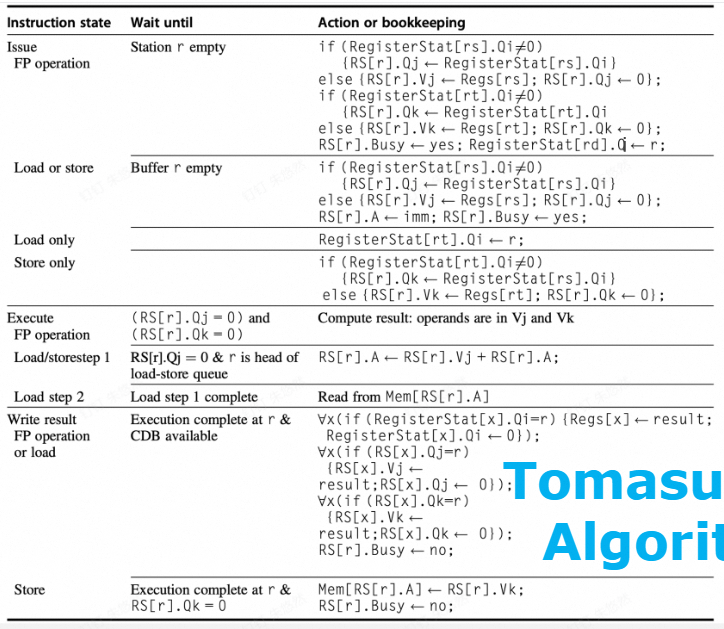
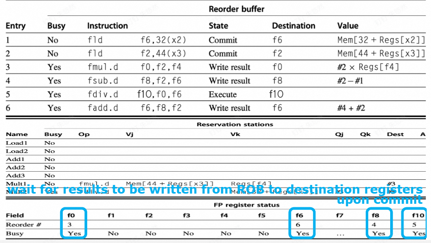
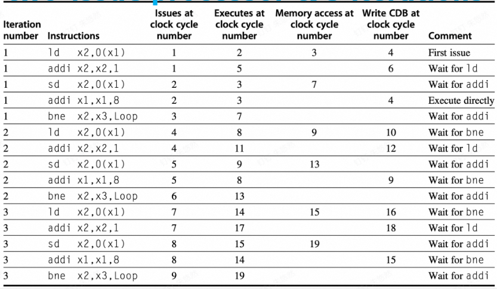
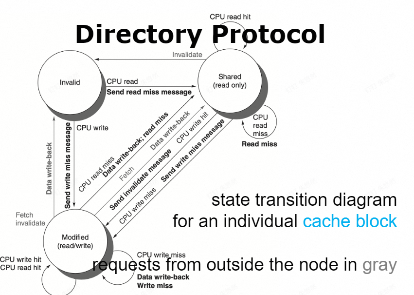
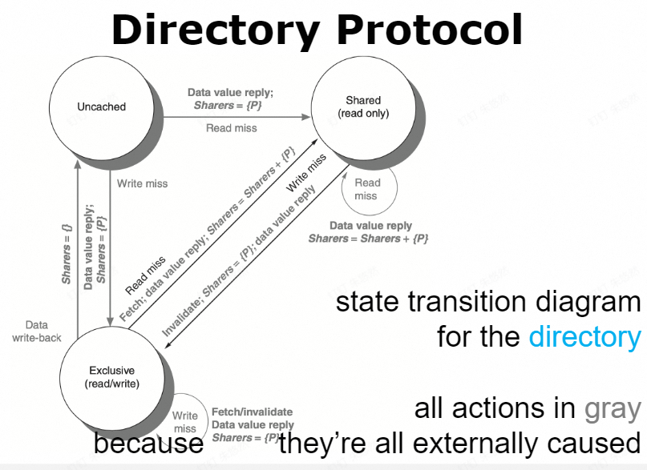
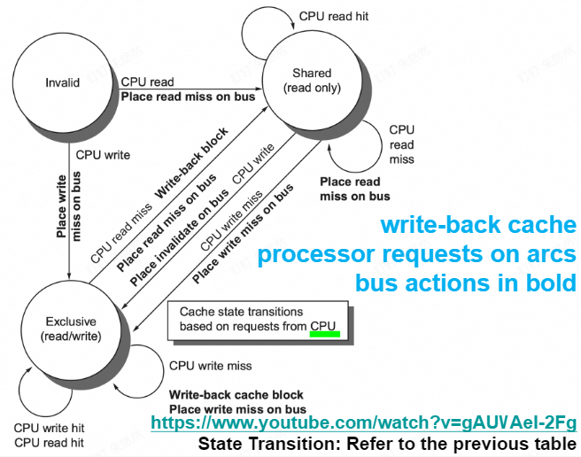

# 第一章 概论 & performance

* Dennard Scaling: Power density is constant for a given area, end in 2004
* Moore's law: number of transistors per chip double every (two since 1975) year, end in 2015
* Amdahl's law:

    $Speedup=\cfrac{Exe\ time_{old}}{Exe\ time_{new}}=\cfrac{1}{(1-Frac_{enhanced})+\cfrac{Frac_{enhanced}}{Speedup_{enhanced}}}$

* Lhadma's Law: Uncommon case not too slow
* Computer types <a style="color:red">[important!]</a>: (P)ersonal (M)obile (D)evice, Desktop, Server, Cluster/(W)arehouse(S)cale(C)omputer, Embedded/IoT computer
* PMD: Cost effectiveness, heat manage, real-time, memory manage
* Desktop: price-performance
* Server: Availability(up time percentage), Scalability, High throughput
* Parallelism <a style="color:red">[important!]</a>: 
    * application level: DataLP, TaskLP
    * hardware level: InstLP(pipeline, speculative), Vector/GPU/MM, ThreadLP, RequestLP
* Parallel arch: SISD, SIMD(vect & gpu), MISD, MIMD(TLP, RLP)
* ISA <a style="color:red">[important!]</a>: Class(register-mem, load-store), mem addressing(alignment), op size & type, address mode, op(data, alu, control, float), control flow inst, encoding
* Concepts: Bandwidth & throughput, latency & response time
* $E=\overline{P}\times t_{exe}$
* $E_{dynamic}\propto Capacitive\ load\times V^2$
* $P_{dynamic}\propto E_{dynamic}\times frequency$ 降频，降功不降能, $P_{static}=C\times V$
* Impove Energy: (D)ynamic (V)otage-(F)requency (S)caling, design for typical case, overclock/turbo, ...
* $Dies\ per\ wafer=\cfrac{\pi r^2}{Die\ area}-\cfrac{\pi d}{\sqrt{2\times Die\ area}}$
* $Die\ yield=Wafer\ yield\times\cfrac{1}{(1+Defects\ per\ unit\ area\times S_{Die})^N}$
* (CAP)ital (EX)pense(build cost), (OP)erational (EX)penses
* Dependability(is operating properly?) <a style="color:red">[important!]</a>: (S)ervice (L)evel (A)greements, (S)ervice (L)evel (O)bjectives; Failure(not right), Fault causes Error and might turn to failure
* Mean Time To Fail, Mean Time To Repair, Mean Time Between Failures = $MTTF + MTTR$, Availability = $\cfrac{MTTF}{MTBF}$
* RAID: 0, 1(dupe, x2), 2(ecc/hamming code, ?+3), 3(bit parity, +1), 4(block parity, +1), 5(distribute parity, +1), 6(row-diagonal parity, +2)
* Matrises: Execution/response Time, Throughput, performance, A is n times faster than B $n=\cfrac{t_B}{t_A}=\cfrac{Performance_A}{Performance_B}$, CPU time vs Elapsed time(with io ans stuff), SPEC, SPECRatio($\cfrac{t_{ref}}{t_A}$)
* Quantitative principles <a style="color:red">[important!]</a>: temporal(time) locality, space locality, focus on common case, parallelism
* CPU time, CPI, IPC, $CC = IC \times CPI$

# 第二章 Memory

* SRAM for cache, DRAM for main mem
* SRAM: Direct map 1-to-1, Fully Associative 1-to-all, Set Associative, 
* DRAM: (C)olumn/(R)ow (A)ccess (S)trobe
* Average Memory Access Time $=(1-p_m)\times t_h + p_m\times t_m=t_h + p_m\times penalty_m$
* Optimizations: block size, cache size, associative, multi-lvl, prioritize read over write, virtual index & physical tag
* Cause of miss: Compulsory(Cold start), Capacity, Conflict

* TLB: va(page) to pa(frame) buffer
* cache Optimization:
    * Way prediction: to return one data for associative cache to reduce checking for all slots
    * Multibanked caches: support simultaneous access
    * Pipelined Access
    * Nonblocking Cache: serve hits during miss
    * Critical word first(first get the requesed)/Early restart(return the requested as soon as ready)
    * Merge write buffer
    * Compiler: Loop interchange, Blocks
    * Hardware Prefetching: for example inst
    * Compiler Prefetching
    * (H)igh (B)andwidth (M)emory
* VM: modes(U/S/M...), R/W/X control, mode switch, inst sets, VMM

# 第三章 Instruction Level Parallelism

* Latency: 间隔n个cc到值有效，例：alu为0
* Initiation/Repeat Interval: 每n个cc可以issue一个
* Structure hazard: double write(stall / shift reg detect and not issue) & not enough modules
* Dependence: Data(RAW), Name(WAR, WAW), Control(if, ...)
* Static Scheduling: Re-order inst, loop unrolling
* Trace Scheduling: find the most frequent path and compress it.
* Fixup Code: copy code to other path after reorder.

    

* Super block: single entrance, multiple exits(to the same stuff)
* Branch Hazard Solutions: Stall & flush, predict-taken, predict-untaken, delay branch(the next inst must run no matter branch)
* Fetch Stage with (B)ranch (P)redict (B)uffer & (D)irection (P)redictor (static)
* (B)ranch (H)istory (T)able: 

    

* 2-bit predictor: change after 2 consecutive miss
* n-bit predictor: ++ / -- on taken / not taken, >= half then taken.
* Local Predictor: have a redictor for whether last time is taken or not taken.

    

* Global Predictor: Use the history of if other branch is taken, a predictor for every case.

    

* (m, n)predictor, m global history bits, every global history with n-bit **counter**
* gshare/hybrid/alloyed predictor: xor the branch history and PC as the "history" in (m, n) predictor
* tournament predictor: two types of predictors and another selector to see which is better
* tagged hybrid predictor: use tags in global predictor table(aka, "history" to which n-bit predictor to use) tag should be hash with global history(length can vary) and PC, choose the matching hash with longest history, have a fallback if no match

    

* Dynamic Scheduling: ID -> issue & read-op
* Scoreboarding: 
    * IS: Issue, Read op, Exe complete, Write result
    * FUS: Busy, Op, $F_i$(dst, reg_num), $F_j, F_k$(src, reg_num), $Q_j, Q_k$(waiting for another FU's result?, FU_name / null), $R_j, R_k$(when waiting: data ready? bool)
    * RRS: FU(FU_name)
* Tomasulo:
    * (C)ommon (D)ata (B)us
    * Reservation stations
    * no WAW and WAR through reg renaming(using RS)
    * IS: Issue(& read), Exe, Write result
    * (R)eservation (S)tation (S)tatus: Op, $Q_j, Q_k$(Source FU of src, null if ready), $V_j, V_k$(src values), A(imm(before)/mem addr(after)), Busy
        
        
        

* Tomasulo With branch prediction: refetch if prediction wrong, don't commit, only commit the first entry of ROB
    * "IS"(part of ROB): Iss, Exe, Write, Commit
    * (R)e(O)rder (B)uffer: Inst, Dst, Value, Busy, State, Ready
    * RRS: Reorder(which ROB entry write to me), Busy

        
        

    * RS free on Write, ROB free on commit(aka. structure hazard end on write, the next cc can use RS again)
* 隐式重命名：tomasulo用ROB；显式重命名：嗯搞。
* Multiple Issue: static cheduled superscalar(multiple everything), (V)ery (L)ong (I)nstruction (W)ord(multiple EXE), dynamically scheduled superscalar
* Multiple Issue: branch execute is a check point, value ready after write to CDB

    

* Branch Prediction: 2cc for wrong panelty
* Branch folding: store inst instead of/ alongside with target PC
* Return address stack
* Multithreading: Fine-grained(per cc), Coarse-grained(only on costly stall), simultaneous(Can have multiple thread in one cc)

# 第四章 Data Level Parallelism

## Vector

* Convoy: the set of inst that will not cause structure hazard
* Chime: the time taken to exec the convoy
* Optimize: Multi-lane
* Vector length register(VL), max vl(mvl)
* Vector mask(if)
* Mem Banks: min bank size = max cpu access rate / single RAM access rate 
* Stride: access mem a[i], a[i+n], a[i+2n], ...; Unit stride = 1
* (V)ector (L)oa(D) with (S)tride, V(ST)oreS
* Bank busy time should be $\leq$ access interval, which can be calc by stride and mem inst interval, otherwise there will be stall
* Gather-Scatter: use another vector as index

## MultiMedia SIMD

* (FL)oating(OP)erations/s = MIN(Peak mem bandwidth$\times$FP per mem access, Peak FP speed)

## Loop Level Parallelism

* in-iteration dependence
* cross-iteration dependence(loop-carried)
* GCD test, for index aj+b and ck+d, if (b-d)%gcd(c, a)!=0, no loop-carried dependency
* Dependency types: true dependency(RAW), antidependency(WAR), outputdependency(WAW)

# 第五章 Thread Level Parallelism

* (S)ymmetric/Centralized Shared-memory (M)ulti(P)roccessor, (D)istributed Shared-memory (M)ulti(P)roccessor
* Cache Coherence: Global state(mem), Local state(cache)
    * after a write, everyone should get the result if no write
    * read another proccess's write will return the reuslt
    * write order is the same for every one
* Directory based
    * Cache states: Shared(mem up to date), Uncached(no one have a copy), Modified(one node have a copy, mem out of date)
    * 
    * 
    * 
* Snooping
    * write invalidate: write back to mem and invalidate all others, if other is already dirty, abort
    * write update/broadcase: update everyone else
    * MSI: Modified, Shared, Invalid
        * 
        * 
    * MESI: E for when there's only one but clean, write on e does not need invalid on bus
    * MOESI: O for owned modified by the cache, out of date in mem(read miss of M does not need to write back, only do that when replaced)
    * MESIF: F for forward, who should response to a request
    * Coherence Miss:true miss, the data been read is miss; false sharing miss when some other data in the same block cause the miss.
* Synchrinization & Consistency
* Load Reservation(lr.rd) & Store Conditional(sc.rd write 0 on success)
* spin lock: try to get lock until success
* data-race-free: variable can be updated without sync an d no problem
* orders:
    * ordinary ordering/squential consistency: $R\rightarrow W, R\rightarrow R, W\rightarrow W, W\rightarrow R$
    * total store ordering: $R\rightarrow W, R\rightarrow R, W\rightarrow W$
    * partial store: $R\rightarrow W, R\rightarrow R$
    * weak ordering: none
    * Sync ordering, Release consistency: S with everything else, $S_A, S_R$(Aquire and Release), everything after $S_A$ must be after, former than $S_R$ must be former
* 
* 