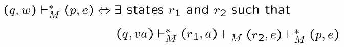
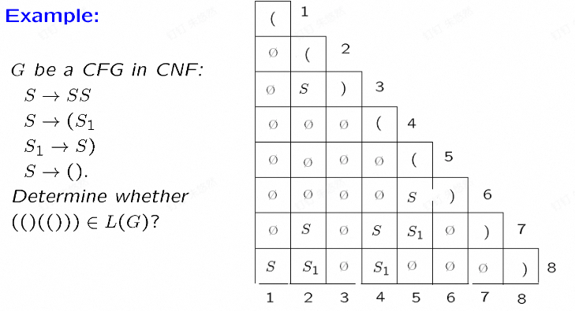

## Chap 1

* Power Set $2^S = \set{T|T\subseteq S}$
* Partition $\sqcap$
* Binary Relation $R\subseteq A\times B$
* Inverse $R^{-1}\subseteq B \times A$
* Function: A relation for every $a\in A$ there is one and only one $b\in B$
* one-to-one 每个函数值不同, onto 可逆, bijection/one-to-one correspendence
* reflexive $(a, a)\in R$, symmetric $(a, b)\rightarrow(b,a)$, antisymmetric$(a, b)\rightarrow !(b,a)$, transitive$(a,b), (b, c)\rightarrow (a, c)$
* Equivelence class $[a]=\set{b|(a, b)\in R}\ or\ R_a$
* Partial Order
* Equinumerous $\exists\ bijection\ f:A\rightarrow B$
* Math principle:
    * Mathematical Induction
    * Pigeonhole Principle
    * Diagonaliztion Principle(mainly for uncountable)
* $2^\mathbb{N}$ is uncountable
* Closure
* $w^R$ reverse
* if$\Sigma$is finite, then $\Sigma^\ast$ is countably inf
* $L^+=LL^\ast$
* Regular: $\Sigma \cup \set{(, ), \cup, \ast}$
* $\mathscr{L}(\Theta)=\emptyset, \mathscr{L}(a) = \set{a}$

## Chap 2

* DFA, NFA
    * "V" start, arrow trans, double circ accept
    * $M_{DFA}(K, \Sigma, \delta, s, F)$ K states, $\Sigma$ alphabet, $\delta(q, a)=q'$
    * $M_{NFA}(K, \Sigma, \Delta, s, F)$ K states, $\Sigma$ alphabet, $(q, a, q')\in \Delta$
* NFA to DFA
    * $E(p)$所有p能e到的状态
    * $K'=2^K, s'=E(s), F'=$所有包含accept状态的子集$\delta(Q, a)=$所有Q中元素可以到达的状态的集合
    * 等价证明：归纳法$(p, w)\vdash^\ast_M(q, e)\Leftrightarrow (E(q), w)\vdash^\ast_{M'}(p\in P, e)$, $w=e$时成立，$w<k$时成立，考虑k时
    * 
    * 
* regular close under $\cup$ Cat $\ast$ $\bar{L}$ $\cap$(用笛卡尔积来同时跑两个)
* regular to FA: use closure to construct from pieces
* FA to regular: 一个一个删状态，确保一个输入，一个输出。
* Extended pumping theorem: $\exists n\geq 1, \forall |w|\geq n, w=xyz\rightarrow y\neq e, |xy|\leq n\ or\ |yz|\leq n, \forall i\geq 0, xy^iz\in L$
* reduction: elimiate all unreachable, all equive(reach accpt on same strings)
* Equive class($\approx_{L(M)} $): 对任意的sufix，类中的所有串是否属于L都一致; $\sim_M$到同一个状态
* 有有限个equive class等价与regular
* 找法，从F和非F开始，根据0步，1步，...推导是否相同来分类，直到稳定或者只有自己一个
* NFA DFA 转换expo，其他poly

## Chap 3

* CFG
    * $G(V, \Sigma, R, S)$ V所有人，R规则
    * 证明，根据规则递归
    * CFG close under $\cup$ Cat $\ast$, 交FA为CFG
    * derivative similar，先做左边比先做右边靠前，先考虑早的步骤，从第一步不同的开始算
* PDA
    * $M(K, \Sigma, \Gamma, \Delta, s, F)$, $\Gamma$ stack symbol, $\Delta=(K\times (\Sigma + e)\times \Gamma^\ast)\times(K\times \Gamma^\ast)$
    * accept on final and empty stack
* CFG to PDA
    * $(s, e, e)(f, S);(f, e, rule_l)(f, rule_r);(f,a,a)(f,e)$
* PDA to CFG
    * simple PDA，增加栈底Z得到单个$s'$和$f'\in F$
    * $S=\lang s,Z,f'\rang\newline((q,a,B)(r,C)), \forall p\lang q, B, p\rang\rightarrow a\lang r, C, p\rang\newline((q,a,B)(r,C_1C_2)),\forall p',p,\lang q, B, p\rang\rightarrow a\lang r,C_1,p'\rang\lang p', C_2, p\rang\newline \forall q\in K\lang q,e,q\rang\rightarrow e$
* pumping theorem: $\exists n, \forall |w|>n, w=uvxyz, |vy|\geq 1, uv^ixy^iz\in L, i\geq 0$
* 全poly
* CNF: $R\subseteq (V-\Sigma)\times V^2$(不能有单个，其他完全) 去长，去e，去单
* 利用CNF判断:
* 

## Chap 4

* TM
    * $TM(K,\Sigma,\delta,s,H)$, $\delta=(K-H)\times \Sigma\rightarrow K\times(\Sigma+\rightarrow+\leftarrow)$
    * Config $(q, \vartriangleright a, aba)=(q,\vartriangleright\underbar{a}aba)$
    * R, L 移动一个;$R_\sqcup$移动到第一个空;可以在条件上声名变量
* recursive TM halt and acc or rej, recursive function if TM compute f
    * compute init be $(s, \vartriangleright \sqcup, w)$
* re TM hlt means yes no halt mean no, semidecide
* recursive close on all
* re colse on all but inverse
* multi tape: 右上角标带子，按偏移分出2k个，一个放带子，一个放位置，所有操作变成切换到带子，然后操作
* NTM 在某个状态停机且有合理输出
* NTM to TM
    * search from one step to inf
* Grammer $(V,\Sigma, R, S)$
* Grammer to TM: use a tape to try generate a tring can choose any rule at each step, check generated is input on every step
* TM to Grammer: 给TM加一个清带机，使得终结于$(h,\vartriangleright\sqcup,)$因此$S\rightarrow\vartriangleright\sqcup h\vartriangleleft$然后根据规则倒着获取规则，用状态作为","来表示带头位置
* Grammetically computable=recursive: $SwS\Rightarrow v\ for\ f(w)=v$
* function
    * $zero_k(\overrightarrow{X})=0$
    * $id_{k,j}(\overrightarrow{X_k})=x_k[j]$
    * $succ(n) = n+1$
    * primitive recursive
    * m-n = m~n
    * digit(m,n,p) = n的mod p中的第m位
    * 对所有的recursive函数，排一排，造一个g(n)是第n个函数调用n，然后+1，这跟所有都不一样，这玩意不recursive
    * $\mu$-recursive = recursive = TM computable

## Chap 5

* U
    * q num for state anum for symbol, $\delta$ for "M"
    * LH re not r, U semidecide LH, for LH$_1$ copy then U semidecide it, for !LH$_1$ it is not even a re
* recursive -> decidable 
* algorithm -> recursive
* if for every i in L f(i) in L2 then L reduce to L2, L n recur, L2 n recur
* re turning-enumerable
* recursive hexilogical-enumerable
* grammer -> re -> no alg to decide if w in L(G)
* cfg $\cap$ cfg =? $\emptyset$ is re