<!-- <style>
.md-typeset ul li {
    margin-bottom: 0px !important;
}
.md-typeset {
    line-height: 1 !important;
}
.md-typeset p {
    margin-top: 0px !important;
    margin-bottom: 0px !important;
    line-height: 1 !important;
}

</style> -->

## $\lambda$ 运算
### BNF描述$\lambda$语言

$\begin{aligned}exp&:=name|func|ap\newline func&:=\lambda name. exp\newline ap&:= exp\ exp\end{aligned}$

$\lambda$干到头，ap只吃一个

### Free Variable

$\begin{aligned}&\rightarrow name\in FV(name)\newline name1 \neq name,name\in FV(exp)&\rightarrow name\in FV(\lambda\ name1.exp)  \newline name\in FV(E_1)\cup FV(E_2)&\rightarrow name\in FV(E_1\ E_2)\end{aligned}$

### Bound Variable

$\begin{aligned}name\in BV(exp)&\rightarrow name\in BV(\lambda\ name1.exp)\newline name1 = name&\rightarrow name\in BV(\lambda\ name1.exp)\newline name\in BV(E_1)\cup BV(E_2)&\rightarrow name\in BV(E_1\ E_2)\end{aligned}$

### Closed 封闭

$FV(t)=\emptyset$

$FV(T)\cap BV(t')=\emptyset$ t 相对 t'封闭（t可以直接扔t'里不出问题）

### $\lambda$ 等价

* 形式等价（一毛一样）

* 语义等价
    * $\alpha$ 变量重命名
    * $\beta$ ap变代换($[exp/x]exp'$)，关注替换中的封闭性问题
    * $\eta$ $\lambda\ x.exp\ x=exp, t=t'\rightarrow \lambda\ x.t=\lambda\ x.t', t_1=t_1'\And t_2=t_2'\rightarrow t_1\ t_2=t_1'\ t_2'$

代换$[b/x]a$中a为target目标，x为subject主题

* $[b/x]x=b$
* $x\neq y,[b/x]y=y$
* $[b/x]o(a_1, a_2, ...)=o([b/x]a_1, [b/x]a_2, ...)$

### function composition

$f\circ g = \lambda\ x.f\ (g\ x)$

### Boolean

$true=\lambda\ x,y.\ x;false=\lambda\ x,y.\ y$

### Church Num

$\overline{0}=zero=\lambda\ s,z.\ z;succ=\lambda\ n,s,z.\ s(n\ s\ z)$

## (A)bstrct (S)yntax (T)ree & (A)bstrct (B)ounding (T)ree

(s)ort类型$S=\set{s,...}$

(o)perator操作符$O_s=\set{o,...}$, $o:(s_1, s_2, ...)\rightarrow s, O=\set{O_0, O_1, ...}$, $O_i$为有i个元数的运算符的集

x变量$X_s=\set{x,...}, X=\set{X_s}_{s\in S}$

结构归纳法，变量绑定，变量捕获，闭包

$G=(V, \Sigma, P, S)$ V 非终结符，$\Sigma$终结符，P规则，S开始符，extern 上下文无关文法

抽象语法树的族 $A[X]=\set{A[X]_s}$

抽象绑定树的族 $o:(s_1,...)s; a_1\in B[X,\overrightarrow{x_1}]_{s_1}, ...;o(\overrightarrow{x_1}.a_1;...)\in B[X]_s$

## E语言($\mathscr{L}\set{num,str}$)

$\begin{aligned}Type\ \tau&:=num,\ str\newline
Exp\ e&:=x,\ num[n],\ str[s],\ plus(a;b),\ times(a;b),\ cat(a;b),\ len(s),\ let(e_1;x.e_2)\end{aligned}$

$\begin{aligned}&\Gamma,x:\tau\vdash x:\tau\newline
&\Gamma\vdash str[s]:str\newline
&\Gamma\vdash num[n]:num\newline
\Gamma\vdash a:num\ \Gamma\vdash b:num\rightarrow&\Gamma\vdash plus(a;b):num\ times(a;b):num\newline
\Gamma\vdash a:str\ \Gamma\vdash b:str\rightarrow&\Gamma\vdash cat(a;b):str\newline
\Gamma\vdash a:str\rightarrow&\Gamma\vdash len(a):num\newline
\Gamma\vdash e_1:\tau_1\ \Gamma,x:\tau_1\vdash e_2:\tau_2\rightarrow&\Gamma\vdash let(e_1;x.e_2):\tau_2\end{aligned}$

* 唯一性：对于一个exp，$\tau$唯一
* 定性反转：对于e=plus(a;b)则e:num, a:num, b:num
* 弱化：$\Gamma$增加新的变量不改变类型
* 代换：不改变类型
* 分解：$\Gamma\vdash[e/x]e':\tau',\ \Gamma\vdash e:\tau$那么$\Gamma,x:\tau\vdash e':\tau'$

引入，确定值的类型；消去，值的类型转化

extern 动态

extern 上下文动态语义

### 函数类型扩展(First Order)($\mathscr{L}\set{num,str,fun}$)

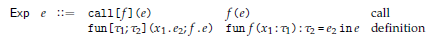

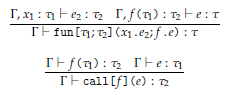


### 函数类型扩展(High Order)($\mathscr{L}\set{num,str,\rightarrow}$)

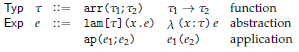


### Godel's T($\mathscr{L}\set{nat,\rightarrow}$)


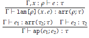


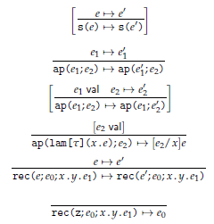


## 递归

total 每个输入都有输出

递归 $f\ 0=c,\ f(n+1)=g(f\ n)\rightarrow \lambda n.n\ g\ c$

原始递归 $f\ 0=c,\ f(n+1)=h(n, f\ n)\rightarrow \lambda n.n\ \lang f.l+1 ,h(f.l, f.r)\rang\ \lang 0, c\rang\ |\ c'=\lang0,c\rang,\ g'=letpair(f'\ n)(\lambda\ x,r.\lang x+1, h\ x\ r\rang)$

$letpair\lang a, b\rang k=k\ a\ b$

$pair = \lambda\ x,y,g.g\ x\ y$

$fst = \lambda\ p.p(true), snd = \lambda\ p.p(false)$

$iter\ \bar{n}\ f\ c = f\ f\ f\ ...\ c$

柯里化 多个参数拆成多个$\lambda$

外延性原理：对于所有输入都相同的两个函数等价

## 有限类型

函数类型 $var:=\cfrac{x:\tau\in\Gamma}{\Gamma\vdash x:\tau}\ ap:=\cfrac{\Gamma\vdash e_1:\tau_2\rightarrow\tau_1\ \Gamma\vdash e_2:\tau_2}{\Gamma\vdash e_1\ e_2:\tau_1},\ lam:=\cfrac{\Gamma, x_1:\tau_1\vdash  e_2:\tau_2}{\Gamma\vdash \lambda x_1.e_2:\tau_1\rightarrow\tau_2}$

$\cfrac{e\rightarrow e'}{\lambda x.e\rightarrow\lambda x.e'}\ \cfrac{e_1\rightarrow e_1'}{e_1e_2\rightarrow e_1'e_2\ e_2e_1\rightarrow e_2e_1'}\ \cfrac{}{(\lambda x.e_1)e_2\rightarrow [e_2/x]e_1}$

范式$\cfrac{e\ nf}{\lambda x.e\ nf}\ \cfrac{}{x\ nf}\ \cfrac{e_1\neq\lambda \Sigma^\ast\ e_1\ nf\ e_2\ nf}{e_1e_2\ nf}$

惰性动态语义（按需解释）急性解释（按值解释）

$\begin{aligned}Typ\ \tau :=\ &unit &mathunit\newline&prod(\tau_1;\tau_2)&\tau_1\times\tau_2\newline
Exp\ e:=\ &triv&\lang\rang\newline&pair(a;b)&\lang a,b\rang\newline&pr[l] (e)&e.l\newline&pr[r] (e)&e.r
\end{aligned}$

extern 积类型

extern 和类型

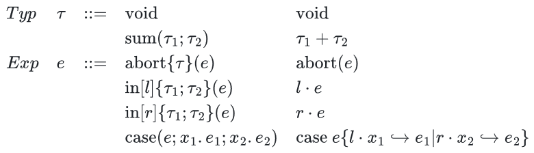

### 原始互递归

$rec\set{e_0;\lambda x.y.e_1}(n) = \lambda(n:nat)iter\ n\set{\lang z,e_0\rang;\lambda x.\lang s(x.l), \lambda x.y.e_1\ x.l\ x.r\rang}$

extern \_\_name\_\_

## PCF

### 等式证明系统

$M=M;\newline
[0+0=0,0+1=1,...]\newline
[Eq?\ n\ n=true,Eq?\ n\ m=false]\newline
[if\ true\ then\ M\ else\ N=M, if\ false\ then\ M\ else\ N=N]\newline
[Proj_1\lang M, N\rang=M, Proj_2\lang M, N\rang=N]\newline
\lang Proj_1 P,Proj_2 P\rang=P\newline
[\lambda x:\sigma.M=\lambda y:\sigma.[y/x]M]\newline
[(\lambda x:\sigma.M)N=[N/x]M]\newline
\lambda x:\sigma.Mx=M\newline
[fix_\sigma=\lambda f:\sigma\rightarrow\sigma.f(fix_\sigma f)]\newline
M=N\rightarrow N=M\newline
M=N, N=P\rightarrow M=P\newline
M=N, P=Q\rightarrow M+P=N+Q\newline
M=N, P=Q\rightarrow Eq?\ M\ P=Eq?\ N\ Q\newline
M=N, P=Q, R=S\rightarrow if\ M\ then\ P\ else\ R=if\ N\ then\ Q\ else\ S\newline
M=N\rightarrow Proj_i M=Proj_i N\newline
M=N, P=Q\rightarrow\lang M, P\rang=\lang N, Q\rang\newline
M=N\rightarrow\lambda x:\sigma.M=\lambda x:\sigma.N\newline
M=N, P=Q\rightarrow M\ P=N\ Q$

其中[]为规约公理

### 左规约

在一般规约的基础上，所有多元操作符按照从左到右顺序，规约第一个非范式。

### 懒规约

在一般规约的基础上，加法、Eq左规约直到左侧为nat，if和函数应用优先规约判据和函数

### 积极规约


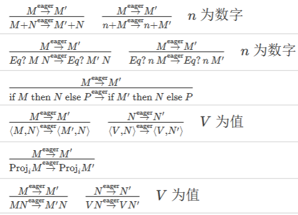

### BNF 描述


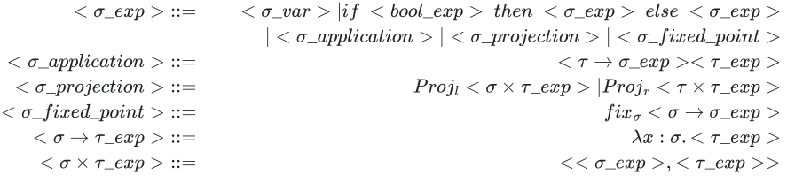

### 公理语义

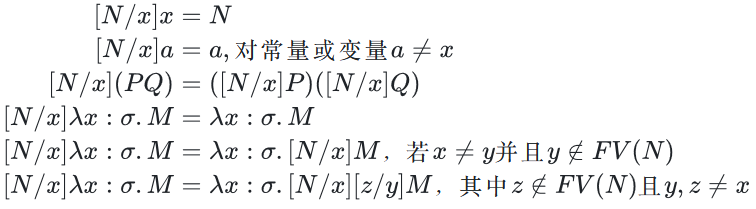

$fix_\sigma=\lambda f:\sigma\rightarrow\sigma.f(fix_\sigma f)$

$fix_\sigma M= M(fix_\sigma M)$

$\eta$等值：$\lambda x:\sigma.Mx=M$，x在M中非自由


### 操作语义


### 惯用语法

$let\ x:\sigma=M\ in\ N\rightarrow(\lambda x:\sigma.N)M$

$fix_\sigma:(\sigma\rightarrow\sigma)\rightarrow\sigma$

$letrec\ f:\sigma=M\ in\ N\rightarrow let\ f:\sigma=fix_\sigma(\lambda f:\sigma.M)\ in\ N$

### Misc

$Proj_l(e)=e.l,Proj_r(e)=e.r$

$Currr = \lambda f:(nat\times nat)\rightarrow nat.\lambda x:nat.\lambda y:nat.f\lang x, y\rang$

完全函数（total function）部分函数（partial function），无穷大/未定义

数值函数，映射关系（单个的值是自己到自己的映射）

“不存在带有数值变量x和y的基本自然数表达式M，使得[n/x] ([m/y]M)=$n^m$”

动态作用域，静态作用域（？按须解释可以被覆盖）

### 程序上下文

例：$C[] = \lambda x:nat.x+[]$

操作等价，对任意的$C[],eval(C[M])\approx eval(C[N])$

### 规约

等价可以乱等，但规约具有方向性$\rightarrow$单步规约$\twoheadrightarrow$多步规约

### 一般递归

伴随泛函$F(f)=n\rightarrow \begin{cases}1&n=0\newline \lang n, f(n')\rang &n=n'+1\end{cases}$

## Plotkin's PCF($\mathscr{L}\set{nat,\rightharpoonup}$)

### 类型


### 静态

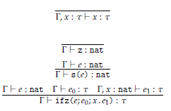


### 动态

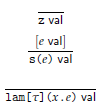

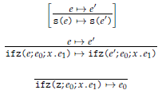


## 无限类型

### 泛型

$\cfrac{t.\tau\ poly\ \Gamma,x:\rho\vdash e':\rho'\ \Gamma\vdash e:[\rho/t]\tau}{\Gamma\vdash map\set{t.\tau}(x.e')(e):[\rho'/t]\tau}$

正类型算子，t只出现在值域中

### 归纳类型

$nil\ list, \cfrac{a\ val\ \sigma\ list}{cons(a,\sigma)\ list}$

函数$\begin{cases}f(nil) &= c\newline f(cons(a, sigma))&=h(f_1(a), f_2(sigama))\end{cases}$

$\mu X/F(X):=\cap\set{X|F(X)\subseteq X}$由F归纳定义

如果X是F封闭的，那么$\mu X/F(X)\subseteq X$

### 余归纳类型

$\cfrac{a\ val\ \sigma\ list}{cons(a,\sigma)\ list}$

函数$\begin{cases}head(ext(f, \sigma)) &= f(head(\sigma))\newline tail(ext(f, \sigma))&=ext(f, tail(\sigma))\end{cases}$

$\nu X/F(X):=\cup\set{X|X\subseteq F(X)}$由F余归纳定义

如果X是F致密的，那么$X\subseteq \nu X/F(X)$

### 互模拟

$head(\sigma)=head(\tau)\And tail(\sigma), tail(\tau)$互模拟

### fold(递归类型的例子)

$z:=fold(l.\lang\rang),s(e):=fold(r.e)$

$iter\ n\set{e_0;\lambda x.e_1} = rec_{nat}(x'.(case\ x'\set{l.\\_\hookrightarrow e_0|r.e\hookrightarrow x.e_1\ e});n)$


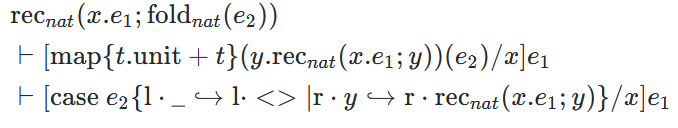

### stream(余递归类型的例子)

直观的理解，$x$是初始值，每一步，初始值会被$e_2$进行修改，而产生的值为修改前的$x$通过$e_1$所产生的数值，如此无限往复产生的无限表

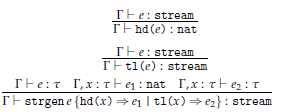

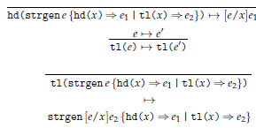


### 语义

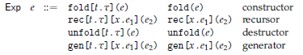

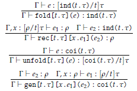

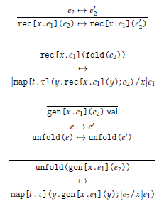

## 并行

* 粒度：两次通信之间每个处理器计算工作量的大小
* 并行度：某一时刻多个处理器上可以同时执行的子任务个数
* 可扩展性：处理器数目增加时并行程序的表现
* 计算通信比：计算花费的时间/处理器间消息传递花费的时间

work(G)总时长，span(G)最长路长度

async:其中的代码异步执行，finish其中的内容全部完成后继续

```
A = F(B)
C = G(A)
D = H(A)
```

```
FA = future{F(B)}
FC = future{G(FA.get())}
FD = future{H(FA.get())}
```
