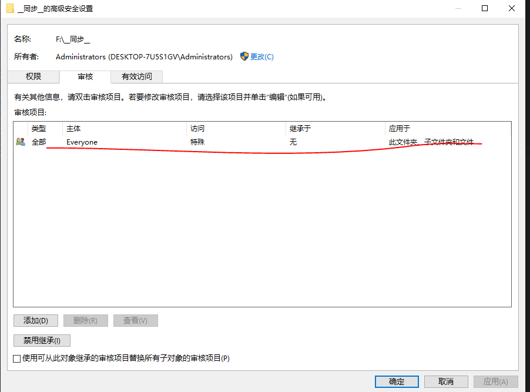

## 1.修改pgedit，启动对象追踪


## 2.创建新的事件视图于事件查看器

``` xml
<QueryList>
  <Query Id="0" Path="Security">
    <Select Path="Security">*[System[(EventID=4656)] and EventData[Data[@Name="ObjectType"]="File"]]</Select>
  </Query>
</QueryList>
```

## 3.修改目标文件夹的配置





## 4.删掉C:\Windows\WinSxS\FileMaps等的审计


``` plain-text
C:\Windows\WinSxS\FileMaps
C:\Windows\Globalization\ELS\SpellDictionaries
C:\Windows\Globalization\ELS\HyphenationDictionaries
C:\Windows\OCR
```
