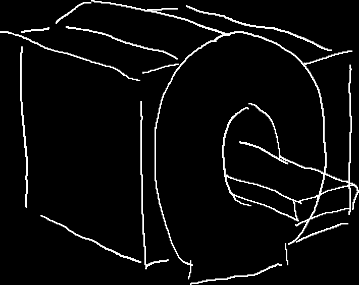

** 标星\* : 有简化**

** 井号# ：待验证？**

## 一、"核""磁""共振"

&emsp;&emsp;我们先从这三个词中最简单的说起。与共振相关的现象我相信即便大家没有自己做过这个实验，也应该知道音叉的共振。

&emsp;&emsp;如果两个音叉的固有频率相同，我们敲击一个音叉，第二个音叉也会跟着震动，即便握住第一个音叉，第二个音叉也会跟着震动，我们也能听到第二个音叉发出的声音。

&emsp;&emsp;根据这个原理，我们可以设计一个实验来检测未知音叉的固有频率。假设我们有三个未知固有频率的音叉。

&emsp;&emsp;我们可以将待测音叉放在一起，然后依次用相似的力度敲击已知频率的一系列音叉，然后依次去听待测音叉的响度，对每个待测音叉响度最大的对应的音叉频率，大概和我们的待测音叉最相近。

&emsp;&emsp;重复这个过程，我们就可以得到三个音叉的频率。核磁共振的原理和这个其实"差不多"，只不过把音叉换成了原子核*，把声音换成了电磁信号（虽说我们最终想要测的量不是"音叉是什么频率"）。

## 二、核磁共振，我们看啥？

&emsp;&emsp;通过上面的比喻，我们大概可以看出，核磁共振能让我们知道很多原子核有关的信息，那我们知道这些信息，能干什么呢？

&emsp;&emsp;如果我们将从原子核到实际数据（你拿到的核磁共振片）之间的步骤当成一个黑匣子，那么你可以通过这项技术"高亮"显示你身体里的某些部分，而医生可以根据这些高亮，来判断你的身体结构有没有问题。

&emsp;&emsp;但这只是应用部分的，如果我们打开这个黑匣子，我们可以看到，这里面有负责造设备的工程师让整个系统能够在一起工作，负责设计序列（我们后面再说啥是序列）的人来控制如何获取数据，处理数据的人将得到的东西搞成人能方便看的形式，以及其他的如程序员编写驱动、用户界面等等。

## 三、理论模型

&emsp;&emsp;在说一台常见的核磁共振仪的具体构成之前，我们先来简单说一说核磁共振原理的概要。我们继续沿用在1中使用的比喻。

&emsp;&emsp;在让音叉共振之前，我们至少得有音叉，在电磁波面前，我们的身体并不\*表现地像个音叉，就像一根没有绷紧的琴弦不会\*发生共振一样，那么如何制造"音叉"呢？我们需要一个非常强大（理想情况下匀强的）的磁场，我们称为B1。这种情况下，就像铁磁性的分子一样，我们身体内的一些极性分子也会发生极化，形成像小磁针一样的结构，顺着磁场排列（这和铁磁性物质的磁化相似，并不是每个原子都顺着磁场排列，而是一批分子在一起，呈现出了一定的极性）。而在医疗领域，身体内主要出现这种性质的原子是氢原子。

&emsp;&emsp;让我们假设我们有一只方形的生物，身体只有27块组织，除了中心的一块是骨骼（氢含量较低）外，其他都是水分充足的组织~~AMOUNGUS~~。这些组织（用一个原子表示）在磁场下出现规律的排列。

&emsp;&emsp;接着，我们需要一个"声源"来让这些氢原子"震动"起来，对这，我们需要一个可控频率的电磁波源。不过，我们都知道了，能够"震动"的是氢原子，所以震动的频率我们其实是知道的，我们想要知道的，其实是氢原子的密度（因为这对不同组织数值不同）所以我们实际测量的是"震动"的"响度"。

&emsp;&emsp;在音叉的实验中，我们可以通过把耳朵贴近某一个特定的音叉来增强某一个特定音叉发出的声音来得到每一个音叉的数据，但在核磁共振中，这并不太现实（音叉太多、太小），我们只能听到所有氢原子混在一起的"声音"。所以我们需要其他的方法来增强某些氢原子的"震动"，对这，我们就需要一个新的磁场称为B1，这个磁场的磁场强度，顺着某一条直线线性减少（也就是每一米减少固定的数值）形成一个梯度。

&emsp;&emsp;这样的一个磁场有什么用呢？这要提到氢原子"震动"的另一个性质，它的频率和它被激发时，所处的场强大小有关。由于磁场可以直接叠加，顺着这个梯度磁场，氢原子"震动"的频率发生有规律的变化，还记得音叉共振的时候，当声音和音叉的固有频率和声音的频率相同时，音叉共振特别明显么？这对氢原子也生效，当激发氢原子的电磁波的频率和前面说到的这个频率相近的时候，"震动"也会特别明显，这样，通过控制梯度磁场的强度以及激发电磁波的频率，我们可以增强某个和梯度磁场中的那条直线垂直的一个面内的氢原子的信号。

&emsp;&emsp;这样，我们可以通过控制梯度磁场的方向，控制增强任意一个平面内的氢原子的信号强度。这样的数据已经足以解算任意一块组织内的氢原子密度了。这个算法我不会，所以我不说了。这和CT中使用的方法是类似（但是CT获取的是一条直线上的数据和，这里是一个平面上的）的。不过这个方法不那么好用，核磁共振中还可以使用一种更加方便的方法，我们后面再说。

## 四、四个线圈

&emsp;&emsp;在一台磁共振仪中，我们可以认为有4个线圈，第一个线圈，提供了永磁场，也就是我们前面说的制造"音叉"的B0磁场。在医院里看到的那些大型"纸卷"，所谓的2T、3T说的就是这个磁场的强度。这个磁场强度非常之强，我记得之前一个磁共振仪的安全教育视频中，一个人在这个磁场下被胸前挂着的剪刀直接吸着拉到了机器上（我找不到视频了，待验证，但是这个磁场确实很强）。一般医院中使用的机器，这个磁场都是通过超导建立的的，在超导内通上电流，只要维持住超导状态，这个磁场就会一直（衰减很少）存在。

&emsp;&emsp;通过精密的调试，大纸卷的中心洞里面的强磁场可以认为是匀强的。

&emsp;&emsp;当然，这个"纸卷"里不止有这个线圈，制造梯度磁场的梯度线圈和发出激发用的电磁波的射频线圈也在里面。由于磁场强度是一个矢量，我们可以通过多个梯度线圈的叠加来实现任意方向的梯度磁场。

&emsp;&emsp;最后，氢原子"震动"（我还是用自旋这个术语把之后再解释）产生的信号强度十分微弱，我们需要一个优秀的耳朵来听这个声音，因此还需要一个接受线圈来捕捉信号，这个线圈一般会根据需要扫描的部位进行放置，比如头线圈，身体线圈，肢体线圈等等。

&emsp;&emsp;这其中，永磁场在正常情况下是不能控制的，但是梯度线圈和射频线圈都是需要精密的信号设计和控制的，而这些信号的设计即使前面提到的序列设计。

&emsp;&emsp;这只是一个大概的结构，一些线圈是可以双工（即既可以发射也可以接受信号）的，那么射频新泉和接受线圈是同一个线圈（不过并不太好用）

## 五、T-1 T-2 弥散

&emsp;&emsp;我们前面提到了，"震动"实际使用的术语是自选，这是因为实际上主要激发可以被检测的电磁波信号的是氢原子的极性方向（画的时候那根穿过原子的箭头，可以理解为小磁针的NS方向矢量）绕着场强方向旋转。

&emsp;&emsp;注意我没有考虑自旋的方向，我没学到那部分。

&emsp;&emsp;当氢离子密度一样的时候，决定信号强度很重要的是自选的时候和磁场方向的倾斜角度。而就像大部分的运动一样，氢离子从不自旋变得自旋需要时间，从自旋回复到不自旋也需要时间。在不同的环境（如水分子中/氨基酸中）这两个时间不同。

&emsp;&emsp;T-1和T-2像就是分别去考量了氢离子开始自旋的时间和从自旋恢复的时间。T-2像可以通过取消激励信号，然后等一段时间检测，然后和激励信号存在时进行比较得到。T-1则是再提供新的激励信号，但是给的时间非常短，不让氢离子达到最大自旋，然后检测。

&emsp;&emsp;# 生物体的内部不是静态的一坨浆糊，而是有可以流动、扩散的液体的。由于就像音叉没了激励源声音后，仍然能够响一会一样，即使没有了激励源，氢原子也会继续自旋一段时间，那么，我们就可以用自旋来标记我们通过梯度和激励频率的平面内的氢原子，然后检测这些被标记的原子的扩散情况，这样可以得到体内存在一些液体屏障（比如血管、神经纤维）的方向。

## 六、更好的信号处理：k空间

