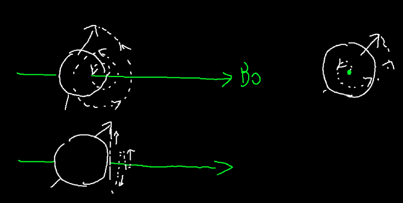
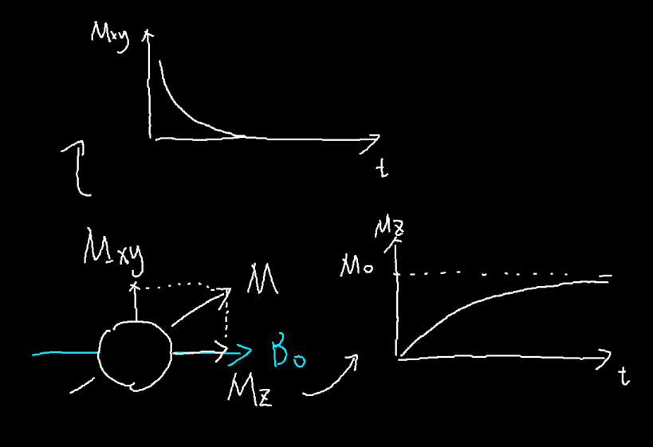
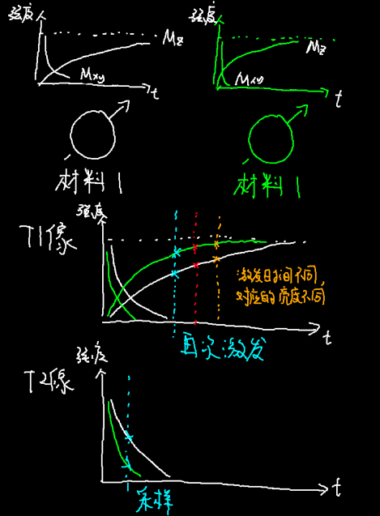
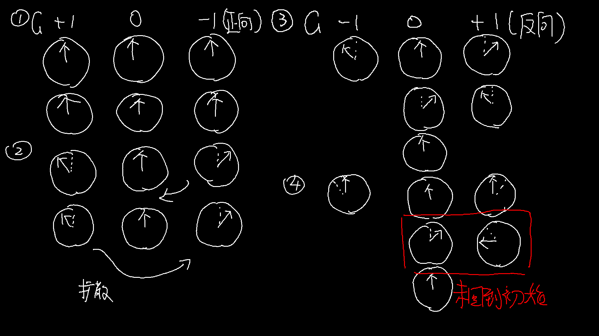
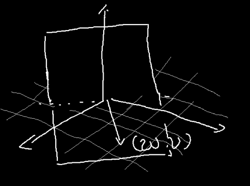
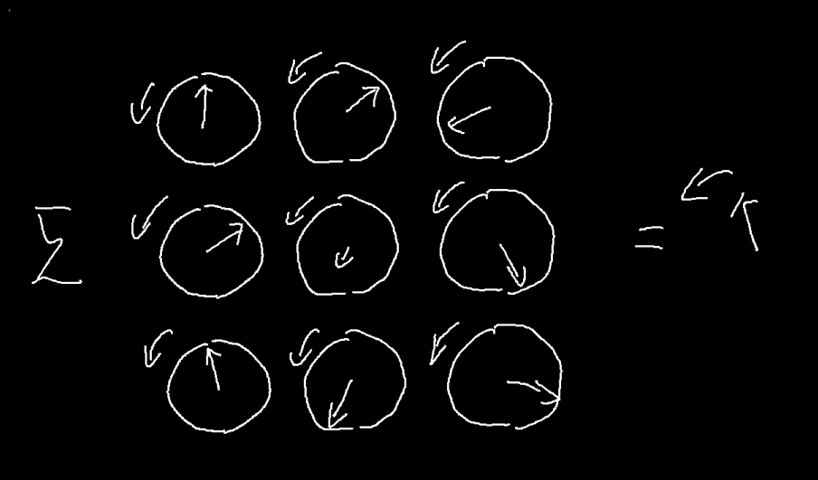
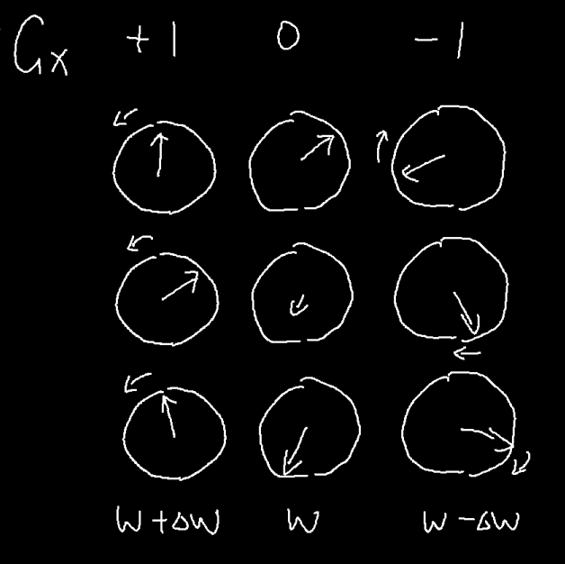

** 标星\*: 有简化 **

## 一、"核""磁""共振"

&emsp;&emsp;我们先从这三个词中最简单的说起。与共振相关的现象我相信即便大家没有自己做过这个实验，也应该知道音叉的共振。

&emsp;&emsp;如果两个音叉的固有频率相同，我们敲击一个音叉，第二个音叉也会跟着震动，并且震动的幅度不断缓慢增加，即便握住第一个音叉，第二个音叉虽然不会继续增加，但还会接着震动，我们还是能听到第二个音叉发出的声音。

&emsp;&emsp;根据这个原理，我们可以设计一个实验来检测未知音叉的固有频率。假设我们有三个未知固有频率的音叉。

&emsp;&emsp;我们可以将待测音叉放在一起，然后依次用相似的力度敲击已知频率的一系列音叉，然后依次去听待测音叉的响度，对每个待测音叉响度最大的对应的音叉频率，大概和我们的待测音叉最相近。

&emsp;&emsp;重复这个过程，我们就可以得到三个音叉的频率。核磁共振的原理和这个其实"差不多"，只不过把音叉换成了原子核*，把声音换成了电磁信号（虽说我们最终想要测的量不是"音叉是什么频率"）。

## 二、核磁共振，我们看啥？

&emsp;&emsp;通过上面的比喻，我们大概可以看出，核磁共振能让我们知道很多原子核有关的信息，那我们知道这些信息，能干什么呢？

&emsp;&emsp;如果我们将从原子核到实际数据（你拿到的核磁共振片）之间的步骤当成一个黑匣子，那么你可以通过这项技术"高亮"显示你身体里的某些部分，而医生可以根据这些高亮，来判断你的身体结构有没有问题。

&emsp;&emsp;但这只是应用部分的，如果我们打开这个黑匣子，我们可以看到，这里面有负责造设备的工程师让整个系统能够在一起工作，负责设计序列（我们后面再说啥是序列）的人来控制如何获取数据，处理数据的人将得到的东西搞成人能方便看的形式，以及其他的如程序员编写驱动、用户界面等等。

## 三、理论模型

&emsp;&emsp;在说一台常见的核磁共振仪的具体构成之前，我们先来简单说一说核磁共振原理的概要。我们继续沿用在（一）中使用的比喻。

&emsp;&emsp;在让音叉共振之前，我们至少得有音叉，在电磁波面前，我们的身体并不\*表现地像个音叉，就像一根没有绷紧的琴弦不会\*发生共振一样，那么如何制造"音叉"呢？我们需要一个非常强大且均匀的磁场，我们称为均匀静态磁场B0。这种情况下，就像铁磁性的分子一样，我们身体内的一些极性分子也会发生极化，很多的这样的分子在一起，在统计学上形成像小磁针一样的结构，顺着磁场排列（这和铁磁性物质的磁化相似，并不是每个原子都顺着磁场排列，而是一批分子在一起，呈现出了一定的极性），这将是我们主要研究的东西。而在医疗领域，身体内主要出现这种性质的原子是氢原子。

&emsp;&emsp;让我们假设我们有一只方形的生物，身体只有27块组织，除了中心的一块是骨骼（氢含量较低）外，其他都是水分充足的组织<del>AMOUNGUS</del>。这些组织（用一个小磁针表示）在磁场下出现规律的排列。

&emsp;&emsp;接着，我们需要一个"声源"来让这些氢原子"震动"起来，对这，我们需要一个可控频率的电磁波源，产生这个电磁波的磁场，我们称为动态磁场或激励磁场B1。不过，我们都知道了，能够"震动"的是氢原子，所以震动的频率我们其实是知道的（可以理解为我们的音叉可以通过魔法调整固有频率），我们想要知道的，很重要的一部分是氢原子的密度（因为这对不同组织数值不同）所以我们实际测量的是"震动"的"响度"，在实际使用中，我们其实还需要测量这些小磁针转动的相位，但这我们之后再说。

&emsp;&emsp;在音叉的实验中，我们可以通过把耳朵贴近某一个特定的音叉来增强某一个特定音叉发出的声音来得到每一个音叉的数据，但在核磁共振中，这并不太现实（音叉太多、太小），我们只能听到所有小磁针混在一起的"声音"。所以我们需要其他的方法来过滤处某些特定的小磁针的"震动"信息，对这，我们就需要一个新的磁场称为梯度磁场G，这个磁场的磁场强度，顺着某一条直线线性减少（也就是每一米减少固定的数值）形成一个梯度，一般来说会使用下标（xyz）来标记顺着的是哪一个方向。

&emsp;&emsp;这样的一个磁场有什么用呢？这要提到小磁针"震动"的另一个性质：它的频率（可以类比音叉的固有频率）和它被激发时，所处的场强大小有关。由于磁场可以直接叠加，顺着这个梯度磁场，氢原子"震动"的频率发生有规律的变化。还记得音叉共振的时候，当声音和音叉的固有频率和声音的频率相同时，音叉共振特别明显么？这对氢原子也生效，当激发氢原子的电磁波的频率和前面说到的这个频率相近的时候，"震动"也会特别明显，这样，通过控制梯度磁场的强度以及激发电磁波的频率，我们可以选定某个和梯度磁场中的那条直线垂直的一个面内的小磁针进行"震动"。

&emsp;&emsp;这样，我们可以通过在激发时使用合适方向的层选梯度磁场，使得只有其中共振频率符合的一层小磁针会被激发，这样的选择是任意的。当然，为了简单起见，我们可以认为只有被这样选定的一层的小磁针发生了偏转。

&emsp;&emsp;实际上来说，小磁针（我们可以使用一个称为磁化矢量的矢量来描述小磁针的方向）并不是真的像音叉一样去震动，而是收到了激励磁场的影响后，一边绕着静态磁场的方向旋转，一遍偏离静态磁场。

## 四、四个线圈

&emsp;&emsp;在一台磁共振仪中，我们可以认为有4个线圈，第一个线圈，提供了静态磁场，也就是我们前面说的制造"音叉"的B0磁场。在医院里看到的那些大型"纸卷"，所谓的1.5T、3T说的就是这个磁场的强度。这个磁场强度非常之强，我记得之前一个磁共振仪的安全教育视频中，一个人在这个磁场下被胸前挂着的剪刀直接吸着拉到了机器上。一般医院中使用的机器，这个磁场都是通过超导线圈内的电流建立的的，只要维持住超导状态，这个磁场就会一直（衰减很少）存在。

&emsp;&emsp;通过精密的调试，大纸卷的中心洞里面的强磁场可以认为是匀强的。

&emsp;&emsp;当然，这个"纸卷"里不止有这个线圈，制造梯度磁场的梯度线圈和发出激发用的电磁波的射频线圈也在里面。虽说在梯度线圈建立的磁场中，磁场的方向都得和静态磁场相同，因此其造成的磁场强度可以看作一个标量，但是其梯度（可以理解为某个点上周围量的变化的最大的方向和变化的量多少）是一个矢量，而且处处相同，通过几组梯度线圈造成的梯度矢量的叠加（比如x、y、z三个方向的三组），可以得到任意方向的梯度。

&emsp;&emsp;最后，小磁针旋转产生的信号强度十分微弱，我们需要一个优秀的"耳朵"来听这个声音，因此还需要一个接受线圈来捕捉信号，这个线圈一般会根据需要扫描的部位进行放置，比如头线圈，身体线圈，肢体线圈等等。

&emsp;&emsp;这其中，静态磁场在正常情况下是不能控制的，但是梯度线圈和射频线圈都是需要精密的信号设计和控制的，而这些信号的设计即使前面提到的序列设计。

&emsp;&emsp;这只是一个大概的结构，一些线圈是可以双工（即既可以发射也可以接受信号）的，那么射频发射线圈和射频接受线圈是同一个线圈（不能同时使用和单工各有优缺，体现在信号强度，功率是否过大，对信号的敏感性等方面）

## 五、T1 T2 弥散

&emsp;&emsp;我们前面提到了，"震动"实际是磁化矢量绕着B0进行旋转，而这变化的磁场发出了电磁波。

&emsp;&emsp;注意我没有规定旋转的方向，这和电磁波有关。

&emsp;&emsp;对于两个相同的小磁针，决定信号强度很重要的是旋转的时候其磁化矢量和磁场方向的倾斜角度（或者说其在与静态磁场方向垂直的面上的投影强度）。通过这个信息，我们就可以得到质子的密度，但是我们还可以通过其他的方法来获取更多的信息。

&emsp;&emsp;在施加完梯度磁场和激励磁场后，小磁针会同时发生两个过程，一个是由于偏离后的小磁针由于不再和B0方向相同，没有了其来维持磁化的属性，这各方向上的磁化向量迅速衰减消失，另一个是小磁针内部的原子中，又有另一部分在B0场的作用下出现了规律的排布，形成了一个新的磁化矢量。

&emsp;&emsp;而就像大部分的运动一样，原磁化矢量消失需要时间，新的磁化矢量出现也需要时间。在不同的环境（如水分子中/氨基酸中）这两个时间不同。

&emsp;&emsp;T1和T2像就是分别去考量了出现和消失所需的时间。在前一个磁化矢量开始衰减一段时间后进行测量，我们就得到了T2加权像。而趁着旧的磁化矢量刚刚消失，新的磁化矢量还没有完全生成，我们就用梯度磁场和激励磁场将新的磁化矢量激发，然后检测，就得到了T1加权像。

&emsp;&emsp;具体来说，对于任意的一个磁化矢量，都可以被分成平行于静态磁场方向的纵向残余矢量$M_z$和横向残余矢量$M_{xy}$，假设在没有被激发时，磁化矢量在B0方向能够达到的最大值为$M_0$，那么随着时间的增加，纵向残余矢量和这个$M_0$之间的差距会逐渐指数减小，而横向残余矢量本身会逐渐指数减小，后者的变化速度更快。量化的来说$M_0-M_z(t)=e^{-\frac{1}{T_1}(M_0-M_z(t=0))}$而$M_{xy}(t)=e^{-\frac{1}{T_2}(M_{xy}(t=0))}$

&emsp;&emsp;当然，对于$M_{xy}$来说，它还有转动频率和相位等信息，这些会在之后再提到。对于两个不同的材料，下图表示了T1和T2的过程。

&emsp;&emsp;这样一来，我们通过T1和T2就可以将不同的组织区分开来了，如果我们在不同的时机测多次，我们也可以定量地计算材料的T1、T2值。

&emsp;&emsp;生物体的内部不是静态的一坨浆糊，而是有可以扩散的液体的。由于就像音叉没了激励源声音后，仍然能够响一会一样，即使没有了激励源，小磁针也会继续旋转一段时间（满足之前T2相关的内容），那么，我们就可以通过一个方向上的梯度磁场使得平面上各位置的小磁针旋转出现相位差，等一段时间让它们扩散，然后再施加一个和刚才那个梯度磁场方向相反的磁场，让各个位置的相位恢复，但是在施加这个磁场之前，有的小磁针在平面上发生扩散，跑到了其他小磁针的位置，在施加这个反向的梯度磁场后，由于相位的改变是和位置相关的，它们跟着这些小磁针发生反向的相位偏差，它就回不到原始的相位了，然后通过检测哪些地方的小磁针没有回到初始的相位，就可以得到体内一些扩散能力在各个方向有区别的组织（比如神经纤维）的方向。

## 六、信号处理：k空间

### 傅里叶变换

&emsp;&emsp;首先，我们先脱离核磁共振来谈一谈傅里叶变换，我先在这里放一个"傅里叶变换公式"

$$\mathscr{F}(\omega) = \int^{+\infin}_{-\infin}f(t)\cdot e^{-\omega ti}dt$$

&emsp;&emsp;看着很花对吧，我们分开来看一看，首先$\mathscr{F}(\omega)$说明什么，说明傅里叶变换造出了一个新的函数，这个函数的自变量是$\omega$

&emsp;&emsp;然后，$e^{-\omega ti}$是什么，这是三角函数的复数形式，现在，为了简化，我们只考虑实数的部分，你可以就把他当成$\cos{\omega t}$。如果我们固定这个$\omega$，我们可以看到对应的$e^{-\omega ti}$就是一个函数乘上一个三角函数，然后积个分。

&emsp;&emsp;那么得到的这个值有什么特点呢，我们看这下面这两个图：

&emsp;&emsp;$f(x)$和三角函数很像，得到的积分（可以视为横轴上面的面积，白色，减去横轴下方的面积，红色）就比较大*，而$g(x)$和三角函数不怎么相似，得到的积分就比较小。实际上，每一个\*函数都可以由一系列\*三角函数加到一起\*来表示，而每一个函数，也可以拆成\*这些三角函数的和\*，这前面我说的像不像，实际上是在说，拆成的这一堆三角函数中，和$\cos{\omega t}$比较接近的一些震动的幅度比较大。也就是说，我们得到的这个积分值，可以反应函数$f(x)$拆成的一系列三角函数中，在$\cos{\omega t}$附近的这一些的震动强度，而附近不附近是由$\omega$的值是否接近来决定的。

&emsp;&emsp;这样看来，这个$\mathscr{F}(\omega)$可以被看做是$f(x)$拆成的一系列三角函数中震动频率（$\omega$就是三角函数$\cos{\omega t}$的震动频率）在$\omega$附近的一些函数的幅度，如果我们把$\mathscr{F}(\omega)$的图像画出来，那么横轴是频率$\omega$而纵轴是幅度，对比$f(x)$的图像，横轴是时间x，纵轴是偏移量，这就是为什么说傅里叶变换是把信号从时域变换到了频域，我们从$f(x)$，每个时间的偏移量，变换到了$\mathscr{F}(\omega)$，$f(x)$拆开后每个频率的三角函数的振幅。

&emsp;&emsp;当然，无视这些，我们还可以有另一种理解，记得加权平均值吗？

$$\overline{x} = \frac{x_1p_1 + x_2p_2 + ... + x_np_n}{p_1 + p_2 + ... p_n}$$

&emsp;&emsp;如果我们让这一堆数据$x_1, x_2, ..., x_n$变成一段函数$f(x)$，对应每个点的权重变成一个权重函数$p(x)$，那么我们得到：

$$\overline{x} = \frac{\int^{+\infin}\_{-\infin}f(x)p(x)dx}{\int^{+\infin}\_{-\infin}p(x)dx}$$

&emsp;&emsp;（注意，这只是一个比喻，真正在傅里叶变换中用到的函数使得上式中的分子积分没有意义）注意到$\int^{+\infin}\_{-\infin}f(x)p(x)dx$和傅里叶变换中的$\int^{+\infin}_{-\infin}f(t)\cdot e^{-\omega ti}dt$是不是很像？所以说，傅里叶变换也可以以被理解成一种加权。

&emsp;&emsp;最后，傅里叶变换还存在一个逆变换，可以用$\mathscr{F}(\omega)$反过来得到$f(x)$，具体是什么既然我们不需要计算我就不写了<del>（绝对不是因为我懒）</del>。

### 然后呢？

&emsp;&emsp;那我说了这么多傅里叶变换，要干什么呢？前面我们提到，在磁共振中，我们能够通过设置梯度磁场和激发电磁波来选定某一个平面内的所有小磁针，但是我们依旧只能"听到"这所有的小磁针发出的"声音"混杂到一起，或者说这些小磁针发出"声音"的叠加。我们依旧需要一种方法求得每一个小磁针发出的"声音"。

&emsp;&emsp;先不管怎么做这个过程，先看看如果我们有我们的结果，我们怎么能得到我们的"声音叠加"，我们得到的信息可以放在在一个二维平面内，作为一个二维的函数$f(x, y)$，其意义是在$(x, y)$处的原子的震动信息。而要得到我们的声音叠加，我们只需要把所有点的函数值加到一起就好了。这一个过程在连续的情况下是啥呢，就是一个二重积分（可以理解为把函数值f(x, y)作为z轴用xyz做出一个三位的面，这个面在xOy平面上方的体积减去xOy平面下方的体积）。

&emsp;&emsp;也就是说，我们从结果的震动信息函数$f(x, y)$得到我们能够测量的声音叠加是一个积分过程，而我们就是想把这个过程反过来。欸，傅里叶变换不就是一个积分过程么，傅里叶变换的反变换不就是把它给反过来么，我们能不能用傅里叶变换呢？我们只需要找到方式来给我们的$f(x, y)$来加个权就好了。如果我们能这么做，那么我们就可以得到傅里叶变化过后的$\mathscr{F}(\omega, v)$的任意值，然后我们就可以用傅里叶反变换得到我们想要的$f(x, y)$了。

### 二维的傅里叶变换

&emsp;&emsp;虽然但是，我们这里要处理的$f(x, y)$是个二维的函数啊，我们先来说一说二维的傅里叶变换是什么样子的。我们依旧给出公式*（这好像和正确的公式有些区别，但是不影响理解。）

$$\mathscr{F}(\omega, v) = \int^{+\infin}\_{-\infin}\int^{+\infin}\_{-\infin}f(x, y)\cdot e^{-\omega xi-vyi}dxdy$$

&emsp;&emsp;为了理解这个玩意，我们考虑一下我们得到的$\mathscr{F}(\omega, v)$是个什么东西。首先，我们考虑一下$\mathscr{F}(0, 0)$，代入上面的公式，可以发现后面的带e的项是1，也就是$f(x, y)$本身的二重积分，正好就是我们直接测量能够得到的"声音叠加"值。

&emsp;&emsp;那么如果有一个不是0呢，比如$\mathscr{F}(\omega, 0)$那么得到的值是$\int^{+\infin}\_{-\infin}\int^{+\infin}\_{-\infin}f(x, y)\cdot e^{-\omega xi}dxdy$。我们用"加权"的方式来理解，那么这时候的加权函数$p(x, y)$是什么样子的呢？是$e^{-\omega xi}$只考虑实部的话，就是$p(x, y)=\cos(\omega xi)$。这是个什么东西呢，就是个瓦楞板：

&emsp;&emsp;也就说得到的值是原函数以这个瓦楞板进行加权，瓦楞板的波有多大和$\omega$有关，那么对于任意的$\omega$和$v$又是什么情况呢？这时我们的加权函数是$p(x, y) = e^{-\omega xi-vyi}$这个函数的图像是什么样子的呢？我们考虑一下$y=\frac{v}{\omega}x$这条直线上以及$y = -\frac{\omega}{v}x$这条直线上。对前者$p(x, y) = e^{-\omega xi-v\frac{v}{\omega}xi} = e^{-(\omega^2+v^2)\omega xi}$也就是在这条直线上加权函数就是一个三角函数波形，而对于后者，$p(x, y) = e^{-\omega xi+v\frac{\omega}{v}xi} = 1$加权函数是也是一根直线，所以说加权函数是沿着向量$(\omega, v)$方向的一个瓦楞板。这个瓦楞板的频率和$sprt(\omega^2+v^2)$有关（也就是这个向量的长度，这里就不推导了）

### 完整的二维傅里叶变换

&emsp;&emsp;前面我们提到了，傅里叶变换中$e^{-\omega xi-vyi}$是个复数，而我们之前都只考虑的了实数的部分。但是我们实际在磁共振中使用的数据是复数（小磁针的幅度和相位差，相位差就是两个小磁针现后转动，用来表征这个时间差的量，这两个量可以用一个复平面中的向量来表达，用向量的长度来表示偏转的幅度，用向量相对横轴正方向的转动角度来表示相位差），所以我们需要再说一说复数中的傅里叶变换。这里，我就找不到一个好的图像来表示了，不过，我们可以从前面的信息里面知道，我们可以通过对信号加权一个函数（这里是个复函数）然后积分得到$\mathscr{F}(\omega, v)$的值。

&emsp;&emsp;这里要再提到一个东西，复数的相乘可以理解为他们的长度发生相乘，然后他们与横轴正方向之间的偏差进行相加，如果两个相乘的向量中，有一个向量的幅值为1，那么就是在改变另一个向量的相位。而我们之前见过很多次，我一直说简化为$cos(\omega t + \theta)$的$e^{\omega ti + \theta i}$在复平面就是一个长度为1的向量，那么它的相位是多少呢？可以这么理解，在最初的时候，其相位为$\theta$，然后从这里开始，它以$\omega$的频率开始旋转，旋转$t$时间，就是当前的相位。

&emsp;&emsp;这时候我们再看对于任意$\omega, v$的加权函数$p(x, y) = e^{-\omega xi-vyi}$，首先我们要注意的是，只有函数值是复数，函数的自变量并不是复数。可以这样理解，我们使用复数，相当于把两个不同的参数放到了一个复数里，你也可以用类似的方法把3个、4ge甚至更多个参数放到一个数里，然后说这个函数的输出是3维、4维的等等，我们使用复数的原因是因为复数有很多很好的性质方便使用。由此，我们之前二维的分析中对加权函数的分析都是可行的。我们注意前面所说的$p(x, y) = e^{-\omega xi-vyi}$这条直线，其方向上的加权函数$e^{-(\omega^2+v^2)\omega xi}$对应的相位差改变$-(\omega^2+v^2)\omega xi$在其方向上是线性改变的，如果以相位差作为纵轴大概是这个样子的：

&emsp;&emsp;简单来说，就是调整相位，然后积分。

### k空间转换

&emsp;&emsp;说了这么多，k空间是个啥？实际上就是我们的$\mathscr{F}(\omega, v)$，叫它k空间只是因为它的$\omega$和$v$对应的数值有物理上的含义。

&emsp;&emsp;那么回到最初的问题，我们只要有方法在原始数据上做一个加权操作，我们就能够得到k空间内（$\mathscr{F}(\omega, v)$的函数值）内的数据了，然后我们就可以快乐地用傅里叶逆变换了，那么如何进行加权呢？

&emsp;&emsp;我们依旧考虑之前那个只有27块组织的生物，假设我们已经通过梯度+电磁波激发的方式选定了中间的这层，我们现在将每个组织块的小磁针的转动方向和强度用一个矢量（磁化矢量在xOy上的投影）来表示，这些矢量会以一个相同的频率进行旋转，它们叠加出来的矢量也会以这个频率旋转。

&emsp;&emsp;如果我们让我们的画布跟着叠加出来的这个矢量旋转，那么看起来，原来的各个小矢量也都是静止的，它们和合成出来的矢量之间，差的只是相位差。

&emsp;&emsp;还记得我们是如何通过层选梯度磁场来选择激发这一层的吗，磁化矢量旋转的频率和磁场的强度正相关。现在我们已经让磁化矢量旋转了起来，我们依旧能通过外加一个梯度磁场来影响磁化矢量的旋转频率，就像我们可以通过调整震动的琴弦的长度来改变其声调：

&emsp;&emsp;这里我们依旧让我们的参考系根据没有增加这个x方向的梯度磁场时，叠加后的矢量的旋转频率转动，这时候，由于梯度磁场的影响图中左侧的磁化矢量的旋转频率增加，右侧的减少，在我们看来，左侧的磁化矢量就会开始正向转动，而右侧的开始反向转动，更重要的是，转动的速度和距离成线性关系。

&emsp;&emsp;这种情况下，我们通过调整施加梯度磁场的时间，可以调整各个磁化矢量的相位相较于没有施加梯度磁场时的相位差，记得之前我们说到，复函数的二维傅里叶变换，就是在用一个线性相位改变函数进行加权的结果。这是我们仅仅施加x方向上的梯度磁场的结果，如果我们同时或者先后施加y方向、z方向上的梯度磁场，我们可以让这个线性的相位改变函数符合任何我们所需的权重函数的形式，也就说，我们找到了一种进行傅里叶变换的方法。

&emsp;&emsp;而且，这种方法可以非常方便地叠加。比如相同的梯度磁场，如果我们施加1ms，对应着得到$\mathscr{F}(\omega, v)$的值，接着如果我们继续施加1ms，我们就能得到$\mathscr{F}(2\omega, 2v)$的值，将这个梯度磁场反向，然后施加2ms，我们又回到了$\mathscr{F}(0, 0)$这使得我们可以方便地设计梯度磁场来"走过"足够的k空间内的数据点。最后，我们就可以用傅里叶反变换（离散情况的）得到我们需要的数据了。

### 频率编码

&emsp;&emsp;前面我们说到过，一维的傅里叶变换可以看作从时域到频域的转换，而我们上面所说的操作中，已经通过梯度磁场让选定的层内的磁化矢量的频率发生了区别，那么我们能不能利用一维傅里叶变换的性质来获取某一串小磁针的数据呢？当然是可以的，我们可以通过调整梯度磁场和采样的间隔，得到一个时间信号，然后进行进行一维的傅里叶变换，就能拿到频域的函数，我们已经知道了每一串小磁针对应的频率，我们就可以在其中找到我们需要的信息。