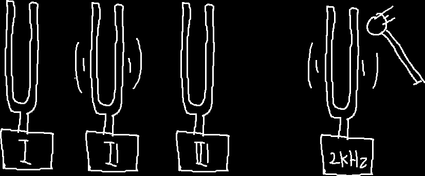
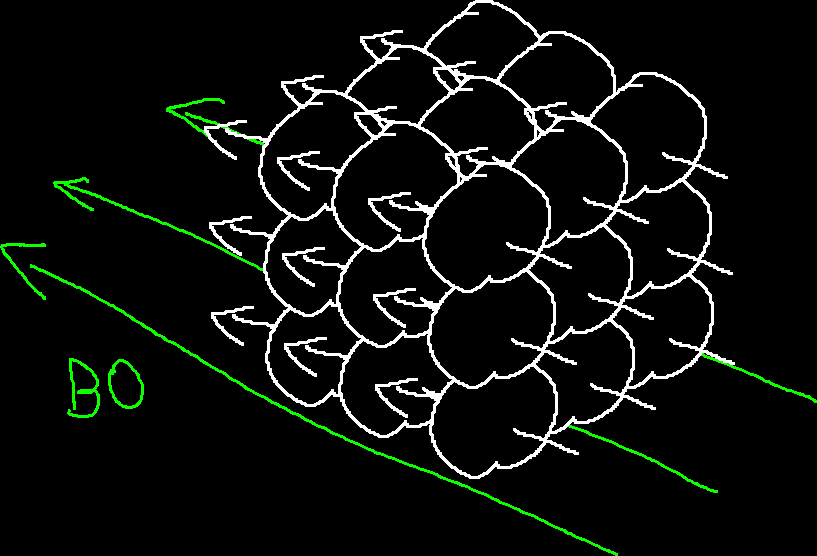
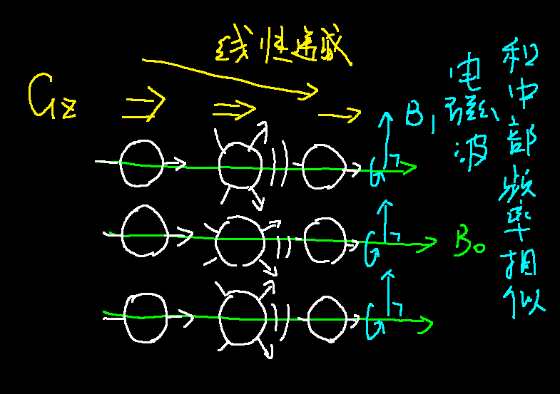
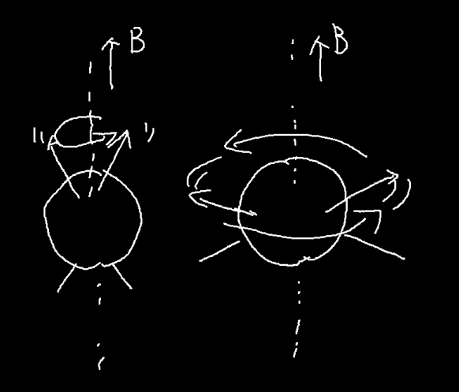
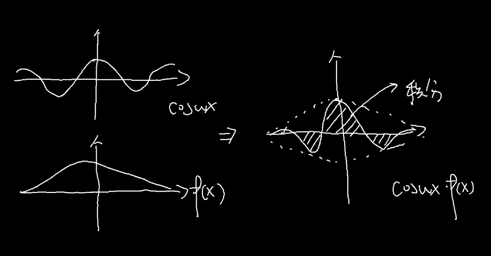
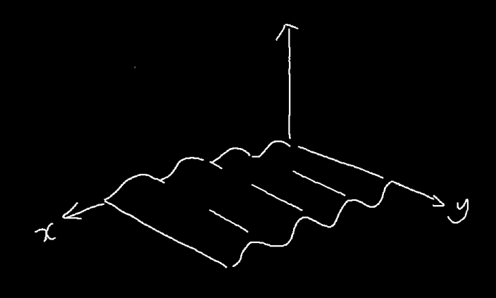
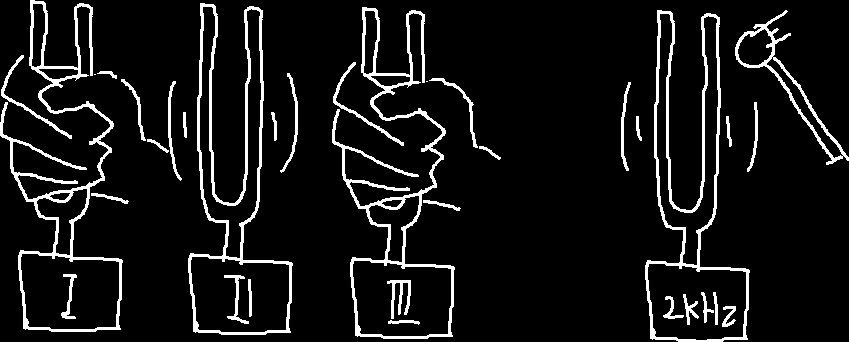

** 标星\*: 有简化 **

** 井号#: 待验证？**

** 注释//: todo **

## 一、"核""磁""共振"

&emsp;&emsp;我们先从这三个词中最简单的说起。与共振相关的现象我相信即便大家没有自己做过这个实验，也应该知道音叉的共振。

&emsp;&emsp;如果两个音叉的固有频率相同，我们敲击一个音叉，第二个音叉也会跟着震动，即便握住第一个音叉，第二个音叉也会接着震动，我们也能听到第二个音叉发出的声音。  // 共振不是一蹴而就的，而是缓慢进行的。实际上是"荡秋千"的过程->T-1

&emsp;&emsp;根据这个原理，我们可以设计一个实验来检测未知音叉的固有频率。假设我们有三个未知固有频率的音叉。

&emsp;&emsp;我们可以将待测音叉放在一起，然后依次用相似的力度敲击已知频率的一系列音叉，然后依次去听待测音叉的响度，对每个待测音叉响度最大的对应的音叉频率，大概和我们的待测音叉最相近。

&emsp;&emsp;重复这个过程，我们就可以得到三个音叉的频率。核磁共振的原理和这个其实"差不多"，只不过把音叉换成了原子核*，把声音换成了电磁信号（虽说我们最终想要测的量不是"音叉是什么频率"）。

## 二、核磁共振，我们看啥？

&emsp;&emsp;通过上面的比喻，我们大概可以看出，核磁共振能让我们知道很多原子核有关的信息，那我们知道这些信息，能干什么呢？

&emsp;&emsp;如果我们将从原子核到实际数据（你拿到的核磁共振片）之间的步骤当成一个黑匣子，那么你可以通过这项技术"高亮"显示你身体里的某些部分，而医生可以根据这些高亮，来判断你的身体结构有没有问题。

&emsp;&emsp;但这只是应用部分的，如果我们打开这个黑匣子，我们可以看到，这里面有负责造设备的工程师让整个系统能够在一起工作，负责设计序列（我们后面再说啥是序列）的人来控制如何获取数据，处理数据的人将得到的东西搞成人能方便看的形式，以及其他的如程序员编写驱动、用户界面等等。

## 三、理论模型

// B0场改为均匀静态磁场1.5T/3T 超导线圈 均匀，强大 B1动态磁场 激励磁场 梯度磁场 G 缓慢变化 磁化矢量

// 氢原子本身没有T1T2 G场和B0的方向相同

// 梯度处处相等，梯度矢量可以叠加

&emsp;&emsp;在说一台常见的核磁共振仪的具体构成之前，我们先来简单说一说核磁共振原理的概要。我们继续沿用在（一）中使用的比喻。

&emsp;&emsp;在让音叉共振之前，我们至少得有音叉，在电磁波面前，我们的身体并不\*表现地像个音叉，就像一根没有绷紧的琴弦不会\*发生共振一样，那么如何制造"音叉"呢？我们需要一个非常强大（理想情况下匀强的）的磁场，我们称为均匀静态磁场B0。这种情况下，就像铁磁性的分子一样，我们身体内的一些极性分子也会发生极化，形成像小磁针一样的结构，顺着磁场排列（这和铁磁性物质的磁化相似，并不是每个原子都顺着磁场排列，而是一批分子在一起，呈现出了一定的极性）。而在医疗领域，身体内主要出现这种性质的原子是氢原子。

&emsp;&emsp;让我们假设我们有一只方形的生物，身体只有27块组织，除了中心的一块是骨骼（氢含量较低）外，其他都是水分充足的组织<del>AMOUNGUS</del>。这些组织（用一个小磁铁表示）在磁场下出现规律的排列。

&emsp;&emsp;接着，我们需要一个"声源"来让这些氢原子"震动"起来，对这，我们需要一个可控频率的电磁波源。不过，我们都知道了，能够"震动"的是氢原子，所以震动的频率我们其实是知道的，我们想要知道的，其实是氢原子的密度（因为这对不同组织数值不同）所以我们实际测量的是"震动"的"响度"。

&emsp;&emsp;在音叉的实验中，我们可以通过把耳朵贴近某一个特定的音叉来增强某一个特定音叉发出的声音来得到每一个音叉的数据，但在核磁共振中，这并不太现实（音叉太多、太小），我们只能听到所有氢原子混在一起的"声音"。所以我们需要其他的方法来增强某些氢原子的"震动"，对这，我们就需要一个新的磁场称为动态磁场B1，这个磁场的磁场强度，顺着某一条直线线性减少（也就是每一米减少固定的数值）形成一个梯度。

// B1改为$G_Z/G_{SELECT}$

&emsp;&emsp;这样的一个磁场有什么用呢？这要提到氢原子"震动"的另一个性质，它的频率和它被激发时，所处的场强大小有关。由于磁场可以直接叠加，顺着这个梯度磁场，氢原子"震动"的频率发生有规律的变化，还记得音叉共振的时候，当声音和音叉的固有频率和声音的频率相同时，音叉共振特别明显么？这对氢原子也生效，当激发氢原子的电磁波的频率和前面说到的这个频率相近的时候，"震动"也会特别明显，这样，通过控制梯度磁场的强度以及激发电磁波的频率，我们可以增强某个和梯度磁场中的那条直线垂直的一个面内的氢原子的信号。

// 不要讲原子 翻倒 ms等级 B0方向不足以产生新的 T1 B0 方向长出一个新的矢量反指数，可以张到一半就给它翻起来， T2 旋转矢量消散指数形式， 一般更快

&emsp;&emsp;这样，我们可以通过在激发时使用合适方向的层选制梯度磁场，使得只有其中共振频率符合的一层小磁针会被激发，这样就可以控制地激发任意的一个平面内的小磁针。当然，为了简单起见，我们可以认为只有被这样选定的一层的小磁针发生了偏转。<del>这样的数据已经足以解算任意一块组织内的氢原子密度了。这个算法我不会，所以我不说了。这和CT中使用的方法是类似（但是CT获取的是一条直线上的数据和，这里是一个平面上的）的。不过这个方法不那么好用，核磁共振中还可以使用一种更加方便的方法，我们后面再说。</del>

## 四、四个线圈

&emsp;&emsp;在一台磁共振仪中，我们可以认为有4个线圈，第一个线圈，提供了永磁场，也就是我们前面说的制造"音叉"的B0磁场。在医院里看到的那些大型"纸卷"，所谓的1.5T、3T说的就是这个磁场的强度。这个磁场强度非常之强，我记得之前一个磁共振仪的安全教育视频中，一个人在这个磁场下被胸前挂着的剪刀直接吸着拉到了机器上（我找不到视频了，待验证，但是这个磁场确实很强）。一般医院中使用的机器，这个磁场都是通过超导线圈内的电流建立的的，只要维持住超导状态，这个磁场就会一直（衰减很少）存在。

&emsp;&emsp;通过精密的调试，大纸卷的中心洞里面的强磁场可以认为是匀强的。

// v 改！

&emsp;&emsp;当然，这个"纸卷"里不止有这个线圈，制造梯度磁场的梯度线圈和发出激发用的电磁波的射频线圈也在里面。由于磁场强度是一个矢量，我们可以通过多个梯度线圈的叠加来实现任意方向的梯度磁场。

// 旋转的"小磁针"

&emsp;&emsp;最后，氢原子"震动"（我还是用自旋这个术语把之后再解释）产生的信号强度十分微弱，我们需要一个优秀的耳朵来听这个声音，因此还需要一个接受线圈来捕捉信号，这个线圈一般会根据需要扫描的部位进行放置，比如头线圈，身体线圈，肢体线圈等等。

&emsp;&emsp;这其中，永磁场在正常情况下是不能控制的，但是梯度线圈和射频线圈都是需要精密的信号设计和控制的，而这些信号的设计即使前面提到的序列设计。

&emsp;&emsp;这只是一个大概的结构，一些线圈是可以双工（即既可以发射也可以接受信号）的，那么射频发射线圈和射频接受线圈是同一个线圈（不能同时使用，各有优缺）

## 五、T-1 T-2 弥散

// 进动

&emsp;&emsp;我们前面提到了，"震动"实际使用的术语是// ，这是因为实际上主要激发可以被检测的电磁波信号的是氢原子的极性方向（画的时候那根穿过原子的箭头，可以理解为小磁针的NS方向矢量）绕着场强方向旋转。

&emsp;&emsp;注意我没有考虑自旋的方向，我没学到那部分。

&emsp;&emsp;当氢离子密度一样的时候，决定信号强度很重要的是自选的时候和磁场方向的倾斜角度。而就像大部分的运动一样，氢离子从不自旋变得自旋需要时间，从自旋回复到不自旋也需要时间。在不同的环境（如水分子中/氨基酸中）这两个时间不同。

&emsp;&emsp;T-1和T-2像就是分别去考量了氢离子开始自旋的时间和从自旋恢复的时间。T-2像可以通过取消激励信号，然后等一段时间检测，然后和激励信号存在时进行比较得到。T-1则是再提供新的激励信号，但是给的时间非常短，不让氢离子达到最大自旋，然后检测。

// tti 血液流动太快 测不了

// 质子密度

&emsp;&emsp;# 生物体的内部不是静态的一坨浆糊，而是有可以流动、扩散的液体的。由于就像音叉没了激励源声音后，仍然能够响一会一样，即使没有了激励源，氢原子也会继续自旋一段时间，那么，我们就可以用自旋来标记我们通过梯度和激励频率的平面内的氢原子，然后检测这些被标记的原子的扩散情况，这样可以得到体内存在一些液体屏障（比如血管、神经纤维）的方向。

## 六、更好的信号处理：k空间

### 傅里叶变换

&emsp;&emsp;首先，我们先脱离核磁共振来谈一谈傅里叶变换，我先在这里放一个"傅里叶变换公式"

$$\mathscr{F}(\omega) = \int^{+\infin}_{-\infin}f(t)\cdot e^{-\omega ti}dt$$

&emsp;&emsp;看着很花对吧，我们分开来看一看，首先$\mathscr{F}(\omega)$说明什么，说明傅里叶变换造出了一个新的函数，这个函数的自变量是$\omega$

&emsp;&emsp;然后，$e^{-\omega ti}$是什么，这是三角函数的复数形式，现在，为了简化，我们只考虑实数的部分，你可以就把他当成$\cos{\omega t}$。如果我们固定这个$\omega$，我们可以看到对应的$e^{-\omega ti}$就是一个函数乘上一个三角函数，然后积个分。

&emsp;&emsp;那么得到的这个值有什么特点呢，我们看这下面这两个图：

&emsp;&emsp;$f(x)$和三角函数很像，得到的积分（可以视为横轴上面的面积，白色，减去横轴下方的面积，红色）就比较大*，而$g(x)$和三角函数不怎么相似，得到的积分就比较小。实际上，每一个\*函数都可以由一系列\*三角函数加到一起\*来表示，而每一个函数，也可以拆成\*这些三角函数的和\*，这前面我说的像不像，实际上是在说，拆成的这一堆三角函数中，和$\cos{\omega t}$比较接近的一些震动的幅度比较大。也就是说，我们得到的这个积分值，可以反应函数$f(x)$拆成的一系列三角函数中，在$\cos{\omega t}$附近的这一些的震动强度，而附近不附近是由$\omega$的值是否接近来决定的。

&emsp;&emsp;这样看来，这个$\mathscr{F}(\omega)$可以被看做是$f(x)$拆成的一系列三角函数中震动频率（$\omega$就是三角函数$\cos{\omega t}$的震动频率）在$\omega$附近的一些函数的幅度，如果我们把$\mathscr{F}(\omega)$的图像画出来，那么横轴是频率$\omega$而纵轴是幅度，对比$f(x)$的图像，横轴是时间x，纵轴是偏移量，这就是为什么说傅里叶变换是把信号从时域变换到了频域，我们从$f(x)$，每个时间的偏移量，变换到了$\mathscr{F}(\omega)$，$f(x)$拆开后每个频率的三角函数的振幅。

&emsp;&emsp;当然，无视这些，我们还可以有另一种理解，记得加权平均值吗？

$$\overline{x} = \frac{x_1p_1 + x_2p_2 + ... + x_np_n}{p_1 + p_2 + ... p_n}$$

&emsp;&emsp;如果我们让这一堆数据$x_1, x_2, ..., x_n$变成一段函数$f(x)$，对应每个点的权重变成一个权重函数$p(x)$，那么我们得到：

$$\overline{x} = \frac{\int^{+\infin}\_{-\infin}f(x)p(x)dx}{\int^{+\infin}\_{-\infin}p(x)dx}$$

&emsp;&emsp;注意到$\int^{+\infin}\_{-\infin}f(x)p(x)dx$和傅里叶变换中的$\int^{+\infin}_{-\infin}f(t)\cdot e^{-\omega ti}dt$是不是很像？所以说，傅里叶变换也可以以被理解成一种加权。

&emsp;&emsp;最后，傅里叶变换还存在一个逆变换，可以用$\mathscr{F}(\omega)$反过来得到$f(x)$，具体是什么既然我们不需要计算我就不写了<del>（绝对不是因为我懒）</del>。

### 然后呢？

&emsp;&emsp;那我说了这么多傅里叶变换，要干什么呢？前面我们提到，在磁共振中，我们能够通过设置梯度磁场和激发电磁波来强调某一个平面内的所有原子，但是我们依旧只能"听到"这所有的原子发出的声音混杂到一起，或者说这些原子发出声音的叠加。我们依旧需要一种方法求得每一个原子发出的声音。

&emsp;&emsp;先不管怎么做这个过程，先看看如果我们有我们的结果，我们怎么能得到我们的"声音叠加"，我们得到的信息可以放在在一个二维平面内，作为一个二维的函数$f(x, y)$，其意义是在$(x, y)$处的原子的震动信息。而要得到我们的声音叠加，我们只需要把所有点的函数值加到一起就好了。这一个过程在连续的情况下是啥呢，就是一个二重积分（可以理解为把函数值f(x, y)作为z轴用xyz做出一个三位的面，这个面在xOy平面上方的体积减去xOy平面下方的体积）。

&emsp;&emsp;也就是说，我们从结果的震动信息函数$f(x, y)$得到我们能够测量的声音叠加是一个积分过程，而我们就是想把这个过程反过来。欸，傅里叶变换不就是一个积分过程么，傅里叶变换的反变换不就是把它给反过来么，我们能不能用傅里叶变换呢？我们只需要找到方式来给我们的$f(x, y)$来加个权就好了。如果我们能这么做，那么我们就可以得到傅里叶变化过后的$\mathscr{F}(\omega, v)$的任意值，然后我们就可以用傅里叶反变换得到我们想要的$f(x, y)$了。

### 二维的傅里叶变换

&emsp;&emsp;虽然但是，我们这里要处理的$f(x, y)$是个二维的函数啊，我们先来说一说二维的傅里叶变换是什么样子的。我们依旧给出公式*（这好像和正确的公式有些区别，但是不影响理解。）

$$\mathscr{F}(\omega, v) = \int^{+\infin}\_{-\infin}\int^{+\infin}\_{-\infin}f(x, y)\cdot e^{-\omega xi-vyi}dxdy$$

&emsp;&emsp;为了理解这个玩意，我们考虑一下我们得到的$\mathscr{F}(\omega, v)$是个什么东西。首先，我们考虑一下$\mathscr{F}(0, 0)$，代入上面的公式，可以发现后面的带e的项是1，也就是$f(x, y)$本身的二重积分，正好就是我们直接测量能够得到的"声音叠加"值。

&emsp;&emsp;那么如果有一个不是0呢，比如$\mathscr{F}(\omega, 0)$那么得到的值是$\int^{+\infin}\_{-\infin}\int^{+\infin}\_{-\infin}f(x, y)\cdot e^{-\omega xi}dxdy$。我们用"加权"的方式来理解，那么这时候的加权函数$p(x, y)$是什么样子的呢？是$e^{-\omega xi}$只考虑实部的话，就是$p(x, y)=\cos(\omega xi)$。这是个什么东西呢，就是个瓦楞板：

&emsp;&emsp;也就说得到的值是原函数以这个瓦楞板进行加权，瓦楞板的波有多大和$\omega$有关，那么对于任意的$\omega$和$v$又是什么情况呢？这时我们的加权函数是$p(x, y) = e^{-\omega xi-vyi}$这个函数的图像是什么样子的呢？我们考虑一下$y=\frac{v}{\omega}x$这条直线上以及$y = -\frac{\omega}{v}x$这条直线上。对前者$p(x, y) = e^{-\omega xi-v\frac{v}{\omega}xi} = e^{-(\omega^2+v^2)\omega xi}$也就是在这条直线上加权函数就是一个三角函数波形，而对于后者，$p(x, y) = e^{-\omega xi+v\frac{\omega}{v}xi} = 1$加权函数是也是一根直线，所以说加权函数是沿着向量$(\omega, v)$方向的一个瓦楞板。这个瓦楞板的频率和$sprt(\omega^2+v^2)$有关（也就是这个向量的长度，这里就不推导了）

### 完整的二维傅里叶变换

&emsp;&emsp;前面我们提到了，傅里叶变换中$e^{-\omega xi-vyi}$是个复数，而我们之前都只考虑的了实数的部分。但是我们实际在磁共振中使用的数据是复数（小磁针的幅度和相位差，相位差就是两个小磁针现后转动，用来表征这个时间差的量，这两个量可以用一个复平面中的向量来表达，用向量的长度来表示偏转的幅度，用向量相对横轴正方向的转动角度来表示相位差），所以我们需要再说一说复数中的傅里叶变换。这里，我就找不到一个好的图像来表示了，不过，我们可以从前面的信息里面知道，我们可以通过对信号加权一个函数（这里是个复函数）然后积分#得到$\mathscr{F}(\omega, v)$的值。

&emsp;&emsp;这里要再提到一个东西，复数的相乘可以理解为他们的长度发生相乘，然后他们与横轴正方向之间的偏差进行相加，如果两个相乘的向量中，有一个向量的幅值为1，那么就是在改变另一个向量的相位。而我们之前见过很多次，我一直说简化为$cos(\omega t + \theta)$的$e ^ {\omega t + \theta}$在复平面就是一个长度为1的向量，那么它的相位是多少呢？可以这么理解，在最初的时候，其相位为$\theta$，然后从这里开始，它以$\omega$的频率开始旋转，旋转$t$时间，就是当前的相位。

&emsp;&emsp;这时候我们再看对于任意$\omega, v$的加权函数$p(x, y) = e^{-\omega xi-vyi}$，首先我们要注意的是，只有函数值是复数，函数的自变量并不是复数。可以这样理解，我们使用复数，相当于把两个不同的参数放到了一个复数里，你也可以用类似的方法把3个、4ge甚至更多个参数放到一个数里，然后说这个函数的输出是3维、4维的等等，我们使用复数的原因是因为复数有很多很好的性质方便使用。由此，我们之前二维的分析中对加权函数的分析都是可行的。我们注意前面所说的$p(x, y) = e^{-\omega xi-vyi}$这条直线，其方向上的加权函数$e^{-(\omega^2+v^2)\omega xi}$对应的相位差改变$-(\omega^2+v^2)\omega xi$在其方向上是线性改变的，如果以相位差作为纵轴大概是这个样子的：

### k空间转换

&emsp;&emsp;说了这么多，k空间是个啥？实际上就是我们的$\mathscr{F}(\omega, v)$，叫它k空间只是#因为它的$\omega$和$v$对应的数值有物理上的含义。

&emsp;&emsp;那么回到最初的问题，我们只要有方法在原始数据上做一个加权操作，我们就能够得到k空间内（$\mathscr{F}(\omega, v)$的函数值）内的数据了，然后我们就可以快乐地用傅里叶逆变换了，那么如何进行加权呢？

&emsp;&emsp;我们依旧考虑之前那个只有27块组织的生物，假设我们已经通过梯度+电磁波激发的方式选定了中间的这层，我们现在将每个组织块的小磁针的转动方向和强度用一个矢量来表示，这些矢量会以一个相同的频率进行旋转，它们叠加出来的矢量也会以这个频率旋转：

&emsp;&emsp;如果我们让我们的画布跟着叠加出来的这个矢量旋转，那么看起来，原来的各个小矢量也都是静止的，它们和合成出来的矢量之间，差的只是相位差。

&emsp;&emsp;还记得我们是如何通过梯度和激发来选择这一层的吗，氢离子自旋的频率和磁场的强度正相关
